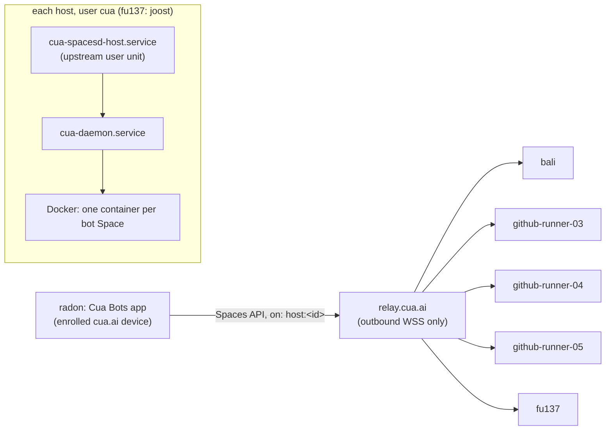

# Cua Bots fleet

[Cua Bots](https://cua.ai/docs/spaces/examples/cua-bots) is a macOS app for
persistent bots: each bot gets its own computer (a Cua *Space*), memory,
routines and approvals. Upstream lets a bot's Space run on the Mac itself or in
Cua Cloud. This fleet adds a third option: Linux Spaces on our own machines,
reached through the cua.ai relay.



## Why it is built this way

- **Relay, not `--direct`.** radon sits on the personal tailnet and the runners
  are tagged devices on the company tailnet. Tagged devices cannot be shared
  across tailnets, so a direct Tailscale address would not reach them. The relay
  is outbound only, so no firewall port opens.
- **Upstream owns the host service.** `cua host setup` writes `~/.cua/host`
  (machine token, `host.json` policy, env token) and the systemd user unit
  `cua-spacesd-host.service`. Nix supplies the binaries, the account, Docker, the
  cua daemon, and restarts after upgrades. This keeps the module independent of
  upstream's file formats, which change between releases.
- **A dedicated `cua` account** (`/var/lib/cua`, lingering, in the `docker`
  group) on the NixOS hosts keeps the machine token and Space state out of
  `joost`'s home.
- **Two stable paths.** The unit runs `~/.cua/host/bin/cua-spacesd`, which
  tmpfiles links to `/run/current-system/sw/bin/cua-spacesd`; setup then sees
  the destination already is the binary and does not copy it. The cua daemon
  runs as a NixOS user unit so the socket always answers. The `cua` path that
  setup records in `host.json` therefore only matters as a fallback, and a GC
  cannot break it.
- **The app patch.** `patches/cua-bots-host-placement.patch` turns `Placement`
  into `{on, name}`. It adds every online machine from `Spaces.hosts()` to the
  new-bot picker and passes `on: "host:<id>"` to `Spaces.create`. Bots saved as
  `"local"`/`"cloud"` still decode.

## Source files

| What | Where |
| --- | --- |
| `cua` CLI and `cua-spacesd` packages | `lib/overlays.nix` (`cuaVersion`, `cuaSpacesdVersion`) |
| NixOS host module | `modules/cua-spaces-host.nix` (`services.cuaSpacesHost`) |
| Enabled on | `hosts/bali.nix`, `hosts/github-runner-0{3,4,5}.nix` |
| Omarchy host (fu137) | `users/cua-spaces-host-omarchy.nix`, imported by `users/joost/home-manager.nix` |
| Controller Mac | `hosts/radon.nix` (`cua` CLI), `scripts/build-cua-bots.sh` |
| App patch | `patches/cua-bots-host-placement.patch` |
| Prune protection on runners | `--filter label!=ai.cua.managed=true` in `modules/ci-disk-cleanup.nix` and the runner pre-job hooks |

## Inventory

| Host | Relay machine | State |
| --- | --- | --- |
| bali | `7d103003c2127572f10f66b8044bb212` | online, smoke-tested 2026-10-03 |
| github-runner-03 | `8d78f4b37d9d39d14d4f2676ffcda34f` | online, smoke-tested 2026-10-03 |
| github-runner-04 | `7a5f9591ee33d7085ee9817648747cf7` | online |
| github-runner-05 | `f4a54561fc0a4a756a7082b059748132` | online |
| fu137 | — | configured; needs the steps under [fu137](#fu137-omarchy) |

Each host runs at most 4 Spaces (`services.cuaSpacesHost.maxSpaces`, applied
at setup). Spaces have no CPU or memory limits of their own: a runner-03 Space
saw all 20 cores and 62 GiB.

## Add a NixOS host

1. Import `../modules/cua-spaces-host.nix` and set
   `services.cuaSpacesHost.enable = true;` in `hosts/<host>.nix`.
2. Deploy (`make switch NIXNAME=<host>`, or push and wait for auto-update).
3. Join the relay once, on the host:

   ```bash
   sudo cua-spaces-host-setup
   ```

   It prints a device-code URL. Approve it within a few minutes; the codes
   expire fast. The script signs in, runs `cua host setup --profile spare`,
   signs out, and prints `cua host status`. The host then keeps only its
   machine token.

To check a host later:

```bash
sudo -u cua -H env XDG_RUNTIME_DIR=/run/user/$(id -u cua) cua host status
```

## fu137 (Omarchy)

Home Manager installs `cua`, `cua-spacesd`, the `cua-daemon` user unit, the
link, and `cua-spaces-host-setup`. Arch owns the rest:

1. Docker from pacman, running, with `joost` in the `docker` group:
   `sudo systemctl enable --now docker.service`.
2. `loginctl enable-linger joost`, so the user units survive logout and reboot.
3. Switch Home Manager. At the time of writing, the fu137 generation does not
   build: VICREO Listener's `Latest` .deb changed upstream and fails its pinned
   hash in `users/companion-omarchy.nix`. That check exists on purpose, so
   update its version and hash before switching.
4. Run `cua-spaces-host-setup` as joost (no sudo) and approve the code.

## Controller Mac (radon)

The app needs a GUI login session (auto-login on a headless Mac), and its
routine clock runs only while the app is open.

1. Switch radon so it has `cua` (auto-update picks it up from `main`).
2. Sign in and enroll the device. Approve the enrollment from bali, which is
   already enrolled as joost:

   ```bash
   cua auth login            # on radon
   cua devices enroll        # prints a code when approval is needed
   cua devices approve <code>   # on bali, as joost
   ```

3. `cua spaces ls` on radon should list all the relay machines above.
4. Build and start the app:

   ```bash
   export ANTHROPIC_API_KEY=... OPENAI_API_KEY=...   # whichever harnesses you use
   ~/nixos-config/scripts/build-cua-bots.sh --run
   ```

   The first build compiles `cua-spaces-ffi` (Rust) and takes a while. In
   **New bot → Its computer**, pick a fleet machine instead of "This Mac". radon
   has no Docker, so "This Mac" fails there.

## Upgrading

Bump `cuaVersion` and `cuaSpacesdVersion` together in `lib/overlays.nix`.
Keep `cua-spacesd` on the minor line that the CLI pins
(`libs/cua-spacesd/VERSION` at the `cua-sdk-v<version>` tag); upstream's own
fallback picks the newest same-minor release. When the app needs a newer
upstream, bump `CUA_REV` in `scripts/build-cua-bots.sh` and refresh the patch.
After a switch, `cua-spacesd-host-restart.service` restarts the upstream unit.
NixOS already restarts `cua-daemon`.

## Risks

- **Runners share Docker with CI.** Any fuww workflow on runner-03/04/05 can
  `docker exec` into a bot's Space and read what the bot holds: harness API
  keys and signed-in sessions. Docker group access on those boxes amounts to
  root, so a separate daemon would not isolate them. Keep sensitive bots on bali
  or fu137. The prune label filter only stops our own cleanup from deleting
  stopped Spaces; a workflow that runs `docker system prune` can still delete
  them.
- **The relay sees connection metadata.** See upstream's
  [What the relay can see](https://cua.ai/docs/spaces/guides/relay-security).
- **bali's joost account is signed in** to cua.ai as an enrolled client. That
  lets agents on bali create Spaces on the fleet. `cua auth logout` and
  `cua devices revoke <id>` undo it.
- **Telemetry** is on by default in the cua programs (`cua telemetry off` per
  account).
- **Rules are not enforcement.** Inside its Space, a bot's harness approves its
  own tool calls (an upstream limit).
