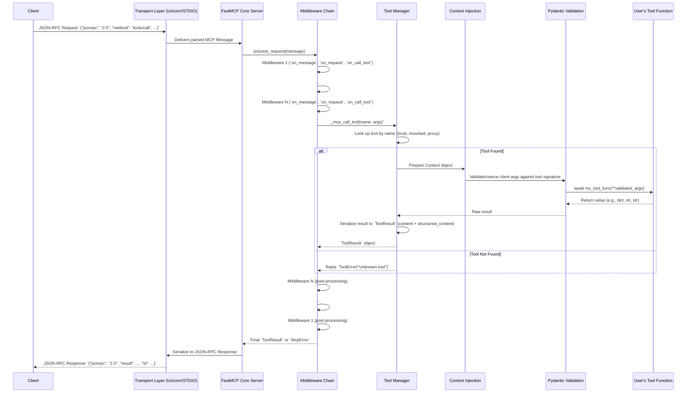

# FastMCP Technical Specification: Part 1 - Foundational Concepts & Server API

This document provides a comprehensive technical specification for the FastMCP framework, focusing on foundational concepts and the server-side API. It is structured for maximal coherence and utility for a Large Language Model.

## 1. Introduction & Core Concepts

### 1.1. The Model Context Protocol (MCP)

The Model Context Protocol (MCP) is an open standard designed to create a secure, interoperable interface between Large Language Models (LLMs) and external systems (tools, data, services). It functions as a standardized communication layer, akin to a "USB-C port for AI," allowing any compliant LLM client to interact with any compliant server.

**Core Tenets of MCP:**
- **Interoperability**: A single MCP server can be consumed by multiple, different LLM clients (e.g., Anthropic Claude, Google Gemini, OpenAI models) without custom integration code.
- **Discoverability**: Clients can dynamically query a server at runtime to understand its capabilities, receiving a structured, machine-readable list of available components.
- **Security**: MCP establishes a sandboxed boundary. An LLM can only request the execution of explicitly exposed, typed, and validated functions, preventing arbitrary code execution.
- **Composability**: MCP encourages the creation of small, specialized servers that can be combined into larger, more complex applications.

### 1.2. MCP Components
An MCP server exposes its capabilities through three primary component types:

- **Tools**: Executable functions that perform actions or produce side effects. They are analogous to `POST` requests in a REST API. An LLM invokes a tool to change state, trigger a process, or perform a calculation.
- **Resources**: Read-only data sources identified by a unique URI. They provide context to the LLM. They are analogous to `GET` requests in a REST API, designed for idempotent information retrieval.
- **Prompts**: Reusable, parameterized message templates that provide structured instructions to guide an LLM's behavior for specific tasks.

### 1.3. FastMCP: The Pythonic Framework

FastMCP is a high-level Python framework that abstracts the complexities of the MCP specification. It provides an ergonomic, decorator-based API for building and interacting with MCP servers.

**Design Philosophy:**
- **🚀 Fast Development**: A high-level interface minimizes boilerplate and accelerates development.
- **🍀 Simple**: Aims to make building MCP servers as simple as writing standard Python functions.
- **🐍 Pythonic**: The API is designed to feel natural and intuitive to Python developers, leveraging features like decorators and type hints.
- **🔍 Complete**: Provides a comprehensive platform for the entire MCP lifecycle, from development and testing to production deployment, including features beyond the core protocol like authentication, middleware, and server composition.

### 1.4. Installation

#### 1.4.1. Standard Installation
Installation is recommended via `uv` or `pip`.

```bash
# Using uv
uv pip install fastmcp
```

```bash
# Using pip
pip install fastmcp
```

#### 1.4.2. Verifying Installation
The `fastmcp version` command provides details about the installed version and its environment.

```bash
$ fastmcp version

FastMCP version:   2.10.5
MCP version:       1.10.0
Python version:    3.12.2
Platform:          ...
FastMCP root path: ...
```

#### 1.4.3. Development Installation
For contributing to FastMCP, clone the repository and install dependencies in a virtual environment.

```bash
git clone https://github.com/jlowin/fastmcp.git
cd fastmcp
uv sync
```
This command installs all runtime and development dependencies, including `pytest` and `pre-commit`.

- **Running Tests**: `pytest`
- **Running Pre-Commit Hooks**: `pre-commit run --all-files`

## 2. The `FastMCP` Server Class

The `fastmcp.FastMCP` class is the central component of any application. It serves as the container for all tools, resources, and prompts, and manages the server's lifecycle and configuration.

### 2.1. Server Instantiation
A server is created by instantiating the `FastMCP` class.

```python
from fastmcp import FastMCP

# Basic server with a name
mcp = FastMCP(name="MyAssistantServer")

# Server with instructions to guide the LLM
mcp_with_instructions = FastMCP(
    name="HelpfulAssistant",
    instructions="""
    This server provides data analysis tools.
    Use the `get_average` tool to analyze numerical data.
    Access configuration via the `resource://config` resource.
    """
)
```

### 2.2. Constructor Parameters

| Parameter                | Type                              | Description                                                                                             |
| ------------------------ | --------------------------------- | ------------------------------------------------------------------------------------------------------- |
| `name`                   | `str`                             | A human-readable name for the server. Defaults to "FastMCP".                                            |
| `instructions`           | `str \| None`                     | A description to guide clients on how to interact with the server.                                      |
| `lifespan`               | `AsyncContextManager \| None`     | An async context manager for server startup and shutdown logic.                                         |
| `tags`                   | `set[str] \| None`                | A set of tags to categorize the server itself.                                                          |
| `tools`                  | `list[Tool \| Callable] \| None`  | A list of tools to add programmatically upon initialization.                                            |
| `**settings`             | `Any`                             | Keyword arguments that override global `ServerSettings`. See section 2.3 for details.                   |

### 2.3. Server Configuration
Server behavior is configured through a combination of constructor arguments and global settings.

#### 2.3.1. Duplicate Component Handling
Controls behavior when a component with a duplicate name/URI is registered.
- `on_duplicate_tools`: `Literal["error", "warn", "replace", "ignore"]` (Default: `"warn"`)
- `on_duplicate_resources`: `Literal["error", "warn", "replace", "ignore"]` (Default: `"warn"`)
- `on_duplicate_prompts`: `Literal["error", "warn", "replace", "ignore"]` (Default: `"warn"`)

```python
from fastmcp import FastMCP

# Raise an error if any tool is registered with the same name twice.
mcp = FastMCP(on_duplicate_tools="error")
```

#### 2.3.2. Tag-Based Filtering (`v2.8.0+`)
Selectively expose components based on tags.
- `include_tags`: `set[str] \| None` - If set, only components with at least one of these tags are exposed.
- `exclude_tags`: `set[str] \| None` - Components with any of these tags are hidden. `exclude_tags` takes precedence over `include_tags`.

```python
mcp = FastMCP(
    # Expose components for production but hide anything marked as internal.
    include_tags={"production"},
    exclude_tags={"internal", "deprecated"}
)

@mcp.tool(tags={"production", "api"})
def public_api_tool(): ...

@mcp.tool(tags={"production", "internal"})
def internal_api_tool(): ... # This tool will be excluded.
```

#### 2.3.3. Other Settings
- `dependencies`: `list[str] \| None` - A list of Python package dependencies required by the server, used by the `fastmcp install` command.
- `mask_error_details`: `bool` (Default: `False`) - If `True`, internal exception details are suppressed in MCP error responses sent to the client. `ToolError` and `ResourceError` messages are always sent.
- `tool_serializer`: `Callable[[Any], str] \| None` - A custom function to serialize non-string tool return values. Defaults to JSON serialization.

### 2.4. Running the Server
The `mcp.run()` method starts the server. It should be placed within an `if __name__ == "__main__":` block for compatibility.

```python
# my_server.py
from fastmcp import FastMCP

mcp = FastMCP(name="MyServer")

# ... tool, resource, and prompt definitions ...

if __name__ == "__main__":
    mcp.run()
```

#### 2.4.1. Transports
The `run` method accepts a `transport` argument to specify the communication protocol.

- **`stdio` (default)**: Communicates via standard input/output. The standard for local clients (e.g., Claude Desktop).
- **`http` or `streamable-http` (`v2.3.0+`)**: Runs a Uvicorn web server using the Streamable HTTP transport. This is the recommended transport for web-based deployments.
- **`sse` (legacy)**: Runs a Uvicorn server using the Server-Sent Events transport. Deprecated in favor of `http`.

```python
if __name__ == "__main__":
    # Run server with Streamable HTTP on port 8000, accessible on the local network
    mcp.run(transport="http", host="0.0.0.0", port=8000)
```

#### 2.4.2. Asynchronous Usage
For applications already in an async context, use `mcp.run_async()`.

```python
import asyncio

async def main():
    # ... setup ...
    await mcp.run_async(transport="http")

if __name__ == "__main__":
    asyncio.run(main())
```

> **Note:** `mcp.run()` is synchronous and creates its own event loop. It cannot be called from within an existing async function. Use `run_async()` in such cases.

## 3. Server Components: Tools

Tools are Python functions that an LLM can execute.

### 3.1. The `@tool` Decorator
The primary way to create a tool is with the `@mcp.tool` decorator.

```python
from fastmcp import FastMCP

mcp = FastMCP()

@mcp.tool
def get_weather(city: str, unit: str = "celsius") -> dict:
    """
    Fetches the current weather for a specified city.
    The unit can be 'celsius' or 'fahrenheit'.
    """
    # API call to weather service...
    return {"city": city, "temperature": 22, "unit": unit}
```

FastMCP infers the following from the function:
- **Name**: `get_weather` (from function name)
- **Description**: The function's docstring.
- **Input Schema**: Generated from the parameters `city` and `unit` and their type hints. `city` is required; `unit` is optional with a default.

### 3.2. Decorator Arguments
The decorator can be used to override inferred metadata and add annotations.

| Argument         | Type                          | Description                                                                 |
| ---------------- | ----------------------------- | --------------------------------------------------------------------------- |
| `name`           | `str \| None`                 | Explicitly sets the tool's name.                                            |
| `description`    | `str \| None`                 | Explicitly sets the tool's description, overriding the docstring.           |
| `tags`           | `set[str] \| None`            | A set of strings for categorization.                                        |
| `enabled`        | `bool`                        | If `False`, the tool is disabled and hidden from clients. Default: `True`.  |
| `exclude_args`   | `list[str] \| None`           | A list of argument names to exclude from the schema sent to the LLM.          |
| `annotations`    | `ToolAnnotations \| dict`     | Metadata hints for clients (e.g., `readOnlyHint`, `destructiveHint`).       |
| `output_schema`  | `dict \| None`                | A user-defined JSON schema for the tool's structured output.                |

### 3.3. Tool Parameters and Validation
FastMCP leverages Pydantic for robust input validation based on Python type hints.

#### 3.3.1. Supported Types
A wide range of types are supported, including:
- **Primitives**: `int`, `float`, `str`, `bool`
- **Collections**: `list[T]`, `dict[K, V]`, `set[T]`, `tuple[...]`
- **Date/Time**: `datetime`, `date`, `timedelta`
- **Special Types**: `pathlib.Path`, `uuid.UUID`
- **Constrained Types**: `typing.Literal[...]`, `enum.Enum`
- **Pydantic Models**: For complex, nested data structures.

#### 3.3.2. Parameter Metadata with `Field`
Use `pydantic.Field` with `typing.Annotated` to add descriptions and validation constraints.

```python
from typing import Annotated, Literal
from pydantic import Field

@mcp.tool
def process_data(
    data: list[float],
    method: Annotated[
        Literal["mean", "median", "sum"],
        Field(description="The aggregation method to apply.")
    ] = "mean",
    limit: Annotated[
        int,
        Field(ge=1, le=1000, description="Max number of items to process.")
    ] = 100
) -> float:
    # ... implementation
    return 0.0
```

### 3.4. Return Values: Content vs. Structured Output (`v2.10.0+`)
A tool's return value determines what is sent back to the client. FastMCP supports two forms of output simultaneously:

1.  **Content Blocks**: The traditional MCP format (text, images, audio). This is always generated for backward compatibility.
2.  **Structured Content**: A machine-readable JSON object, enabling clients to deserialize results into typed objects.

#### 3.4.1. Automatic Structured Content Generation
- **Object-like returns** (`dict`, `dataclass`, Pydantic models) always produce structured content.
- **Primitive returns** (`int`, `str`, `bool`, `list`) produce structured content *only if* the function has a return type annotation. To conform to the MCP spec (which requires an object), primitives are wrapped: `{"result": value}`.

#### 3.4.2. Output Schemas
A return type annotation on the tool function generates an `outputSchema` in the tool's definition. This allows clients to reliably parse the `structured_content`.

```python
from dataclasses import dataclass

@dataclass
class WeatherReport:
    city: str
    temperature: float
    condition: str

@mcp.tool
def get_weather_report(city: str) -> WeatherReport:
    """Returns a structured weather report."""
    return WeatherReport(city=city, temperature=22.5, condition="Cloudy")
```
- **Result**: The client receives both a string representation in `content` and a JSON object in `structured_content` that matches the `WeatherReport` schema.

#### 3.4.3. Full Control with `ToolResult`
For explicit control over both content types, return a `fastmcp.tools.tool.ToolResult` object.

```python
from fastmcp.tools.tool import ToolResult
from mcp.types import TextContent

@mcp.tool
def advanced_output() -> ToolResult:
    return ToolResult(
        content=[TextContent(text="The analysis is complete.")],
        structured_content={"status": "complete", "value": 42}
    )
```

### 3.5. Disabling and Removing Tools
- **Disable (`v2.8.0+`)**: Hides the tool from clients. A disabled tool can be re-enabled.
  ```python
  my_tool = mcp.tool(my_function)
  my_tool.disable()
  my_tool.enable()
  ```
- **Remove (`v2.3.4+`)**: Permanently removes the tool from the server.
  ```python
  mcp.remove_tool("my_tool_name")
  ```

## 4. Server Components: Resources & Templates

Resources provide read-only data. Resource Templates are functions that generate data based on URI parameters.

### 4.1. The `@resource` Decorator
The `@mcp.resource(uri)` decorator defines both resources and templates.

```python
from fastmcp import FastMCP

mcp = FastMCP()

# Static Resource (no parameters)
@mcp.resource("data://config.json")
def get_config() -> dict:
    return {"version": "1.2"}

# Resource Template (URI placeholders match function args)
@mcp.resource("api://users/{user_id}/data")
def get_user_data(user_id: int) -> dict:
    # Fetch data...
    return {"id": user_id, "data": "..."}
```

- The function is executed lazily, only when the resource is requested by a client.
- The decorator accepts `name`, `description`, `mime_type`, `tags`, and `enabled` arguments.

### 4.2. Wildcard Parameters (`v2.2.4+`)
A parameter name ending in `*` (e.g., `{filepath*}`) captures multiple path segments, including slashes. This is a FastMCP extension.

```python
@mcp.resource("files://{path*}")
def get_file_content(path: str) -> str:
    # `path` could be "documents/reports/2024.txt"
    # ... read file content ...
    return "file content"
```

### 4.3. Resource Classes
For static content, you can use built-in `Resource` subclasses instead of a function.

```python
from fastmcp.resources import FileResource, TextResource

# Expose a file directly
readme = FileResource(uri="file:///app/README.md", path="/app/README.md")
mcp.add_resource(readme)

# Expose a simple string
notice = TextResource(uri="resource://notice", text="System maintenance tonight.")
mcp.add_resource(notice)
```

## 5. Server Components: Prompts

Prompts are reusable, parameterized message templates.

### 5.1. The `@prompt` Decorator
Defined by decorating a function that returns a message or list of messages.

```python
from fastmcp import FastMCP

mcp = FastMCP()

@mcp.prompt
def system_message_for_task(task_description: str) -> str:
    """Generates a system prompt for a specific task."""
    return f"You are a helpful assistant. Your task is to: {task_description}"
```

### 5.2. Argument Type Conversion (`v2.9.0+`)
While the MCP spec requires prompt arguments to be strings, FastMCP allows typed function parameters. It automatically converts JSON-formatted strings from the client into the specified Python types (`list`, `dict`, `int`, etc.). The required JSON format is advertised in the argument's description.

```python
@mcp.prompt
def analyze_metrics(metrics: list[float], config: dict[str, bool]):
    # Client sends: metrics='[1.2, 3.4]', config='{"normalize": true}'
    # This function receives: metrics=[1.2, 3.4], config={'normalize': True}
    # ... implementation ...
    return "Analyze the data..."
```

## 6. The MCP `Context` Object

The `Context` object is the gateway to advanced, in-request server capabilities. It is available in any tool, resource, or prompt function by adding a parameter type-hinted with `Context`.

```python
from fastmcp import FastMCP, Context

mcp = FastMCP()

@mcp.tool
async def my_contextual_tool(ctx: Context):
    # Use context here
    ...
```

### 6.1. Context Capabilities

#### 6.1.1. Logging
Send log messages back to the client.

- `await ctx.debug(message)`
- `await ctx.info(message)`
- `await ctx.warning(message)`
- `await ctx.error(message)`

#### 6.1.2. Progress Reporting
Notify the client of long-running operation progress.

- `await ctx.report_progress(progress: float, total: float | None, message: str | None)`

#### 6.1.3. LLM Sampling (`v2.0.0+`)
Request a completion from the *client's* LLM.

- `await ctx.sample(messages, system_prompt, temperature, ...)`

```python
@mcp.tool
async def summarize(text: str, ctx: Context) -> str:
    prompt = f"Summarize this text: {text}"
    summary_response = await ctx.sample(prompt)
    return summary_response.text
```

#### 6.1.4. User Elicitation (`v2.10.0+`)
Request structured input from the user during tool execution.

- `await ctx.elicit(message: str, response_type: type)`

The `response_type` can be a primitive (`str`, `int`), a `Literal`, an `Enum`, a `dataclass`, or `None` (for simple confirmation). FastMCP handles wrapping these into spec-compliant object schemas. The method returns an `ElicitationResult` with an `action` (`'accept'`, `'decline'`, `'cancel'`) and a `data` payload.

```python
from dataclasses import dataclass

@dataclass
class UserInfo:
    name: str
    age: int

@mcp.tool
async def get_user_info(ctx: Context) -> dict:
    result = await ctx.elicit("Please provide your info:", response_type=UserInfo)
    if result.action == "accept":
        return result.data.__dict__
    return {"error": "User declined"}
```

#### 6.1.5. Resource Access
Read another resource from within the server.

- `await ctx.read_resource(uri)`

#### 6.1.6. Change Notifications (`v2.9.1+`)
Manually trigger list changed notifications (usually handled automatically).

- `await ctx.send_tool_list_changed()`
- `await ctx.send_resource_list_changed()`
- `await ctx.send_prompt_list_changed()`

## 7. Advanced Patterns: Decorating Methods

Directly applying FastMCP decorators to instance or class methods is not recommended because the decorator captures the unbound method, exposing `self` or `cls` as a parameter to the LLM.

**The correct pattern is to register the bound method after class/instance creation.**

```python
from fastmcp import FastMCP

mcp = FastMCP()

class MyAPIServer:
    def __init__(self, api_key: str):
        self.api_key = api_key

    def get_data(self, item_id: str) -> dict:
        # Instance method uses `self.api_key`
        return {"data": f"data for {item_id}"}

    @classmethod
    def get_server_info(cls) -> dict:
        return {"name": cls.__name__}

    @staticmethod
    def utility_function(a: int, b: int) -> int:
        return a + b

# --- Registration ---

# Instance method: create instance, then register the bound method
api_instance = MyAPIServer(api_key="secret")
mcp.tool(api_instance.get_data)

# Class method: register directly from the class
mcp.tool(MyAPIServer.get_server_info)

# Static method: register directly from the class
mcp.tool(MyAPIServer.utility_function)
```

This ensures that `self` and `cls` are correctly handled and not exposed in the tool's schema.

***

This concludes Part 1. It covers the foundational knowledge required to define and configure a FastMCP server and its components. Part 2 will cover advanced server patterns, the client-side API, and authentication.

# FastMCP Technical Specification: Part 2 - Advanced Server Patterns & Client API

This document is the second part of a three-part technical specification for the FastMCP framework. It details advanced server-side patterns for building complex, modular applications and provides a complete reference for the FastMCP client API.

## 8. Advanced Server Patterns

This section covers advanced techniques for building modular, scalable, and integrated FastMCP servers, including composition, proxying, and integration with existing web frameworks.

### 8.1. Server Composition (`v2.2.0+`)
FastMCP supports composing multiple server instances into a single, unified application. This enables modular design, code reuse, and logical separation of concerns. Composition is achieved through two primary methods: importing (static) and mounting (dynamic).

#### 8.1.1. Importing (Static Composition)
The `import_server()` method performs a **one-time, static copy** of all components (tools, resources, templates, prompts) from a sub-server into the main server. Changes to the sub-server *after* the import are not reflected.

##### **Behavior**
- **Tools**: Prefixed with `{prefix}_`. Example: `get_forecast` becomes `weather_get_forecast`.
- **Resources**: URI path is prefixed. Example: `data://cities` becomes `data://weather/cities`.
- **Prompts**: Prefixed with `{prefix}_`. Example: `daily_briefing` becomes `weather_daily_briefing`.
- **Conflict Resolution**: If prefixes collide, the most recently imported component overwrites any existing component with the same name/URI.
- **Lifespan**: The sub-server's `lifespan` context is **not** executed.

##### **Example**
```python
from fastmcp import FastMCP
import asyncio

# --- Define Sub-server ---
weather_mcp = FastMCP(name="WeatherService")

@weather_mcp.tool
def get_forecast(city: str) -> dict:
    return {"city": city, "forecast": "Sunny"}

@weather_mcp.resource("data://cities/supported")
def list_supported_cities() -> list[str]:
    return ["London", "Paris", "Tokyo"]

# --- Define Main Server ---
main_mcp = FastMCP(name="MainApp")

# --- Import Sub-server (must be async) ---
async def setup_server():
    # Import with a prefix to avoid name collisions
    await main_mcp.import_server(weather_mcp, prefix="weather")

# Run the setup before starting the server
if __name__ == "__main__":
    asyncio.run(setup_server())
    # main_mcp now contains 'weather_get_forecast' tool and 'data://weather/cities/supported' resource.
    main_mcp.run()
```

#### 8.1.2. Mounting (Dynamic Composition)
The `mount()` method creates a **live, dynamic link** between servers. The main server delegates requests to the sub-server at runtime. Changes to the sub-server are reflected immediately.

##### **Behavior**
- **Live Link**: No components are copied. The main server maintains a reference to the sub-server.
- **Dynamic Updates**: If a tool is added to the sub-server after mounting, it immediately becomes available through the main server.
- **Prefixing**: Follows the same prefixing rules as importing for tools, resources, and prompts.
- **Conflict Resolution**: The most recently mounted server takes precedence for a given prefix.

##### **Example**
```python
from fastmcp import FastMCP
import asyncio

# --- Define Sub-server ---
dynamic_mcp = FastMCP(name="DynamicService")

@dynamic_mcp.tool
def initial_tool():
    return "Initial version"

# --- Define and Mount on Main Server (synchronous operation) ---
main_mcp = FastMCP(name="MainAppLive")
main_mcp.mount(dynamic_mcp, prefix="dynamic")

# --- Modify Sub-server AFTER mounting ---
@dynamic_mcp.tool
def tool_added_later():
    return "This tool was added dynamically!"

# The new tool is immediately available through main_mcp.
# A client connecting to main_mcp can now call "dynamic_tool_added_later".
```

#### 8.1.3. Direct vs. Proxy Mounting (`v2.2.7+`)
Mounting has two modes, which FastMCP selects automatically based on the sub-server's configuration.

1.  **Direct Mounting (Default)**:
    - **Trigger**: The sub-server does **not** have a custom `lifespan` context manager.
    - **Mechanism**: The main server accesses the sub-server's components directly in-memory.
    - **Performance**: High performance, minimal overhead.
    - **Behavior**: The sub-server's `lifespan` is **not** executed. No client lifecycle events occur on the sub-server.

2.  **Proxy Mounting**:
    - **Trigger**: The sub-server **has** a custom `lifespan` context manager, or `as_proxy=True` is specified.
    - **Mechanism**: The main server communicates with the sub-server via an internal, in-memory `Client` transport.
    - **Performance**: Slightly higher overhead due to the client/server communication layer.
    - **Behavior**: The sub-server's `lifespan` is executed correctly. Full client lifecycle events are preserved.

You can explicitly control this behavior with the `as_proxy` parameter:
```python
# Force proxy mounting to ensure the sub-server's lifespan is executed
main_mcp.mount(sub_server_with_lifespan, prefix="api", as_proxy=True)
```

#### 8.1.4. Resource Prefix Formats (`v2.4.0+`)
Controls how prefixes are applied to resource URIs during composition.

1.  **`path` (Default)**: The prefix is inserted into the URI's path component. This is the recommended format.
    - **Format**: `protocol://prefix/path/to/resource`
    - **Example**: `data://cities` with prefix `weather` becomes `data://weather/cities`.

2.  **`protocol` (Legacy)**: The prefix is prepended to the protocol scheme.
    - **Format**: `prefix+protocol://path/to/resource`
    - **Example**: `data://cities` with prefix `weather` becomes `weather+data://cities`.

The format can be configured globally via environment variable (`FASTMCP_RESOURCE_PREFIX_FORMAT=protocol`) or per-server:
```python
mcp = FastMCP(resource_prefix_format="protocol")
```

### 8.2. Proxy Servers (`v2.0.0+`)
A FastMCP server can act as a proxy, forwarding requests to a backend MCP server. This is useful for transport bridging, security gateways, or creating a stable endpoint for a dynamic backend.

#### 8.2.1. Creating a Proxy
The `FastMCP.as_proxy()` class method is the primary way to create a proxy. It accepts a backend source, which can be a URL, a file path, an `MCPConfig` dictionary, or a `fastmcp.Client` instance.

```python
from fastmcp import FastMCP
from fastmcp.server.proxy import ProxyClient

# Proxy a remote HTTP server and expose it locally via STDIO.
# ProxyClient is used to ensure full feature support and session isolation.
proxy = FastMCP.as_proxy(
    ProxyClient("https://api.example.com/mcp/"),
    name="MyRemoteProxy"
)

if __name__ == "__main__":
    # Run the proxy with the default STDIO transport for a local client.
    proxy.run()
```
The `as_proxy` method automatically uses `ProxyClient` internally when given a transport source (like a URL or file path) to provide robust session management and feature forwarding.

#### 8.2.2. Session Isolation & Concurrency (`v2.10.3+`)
`ProxyClient` ensures safe concurrent operations by providing session isolation.

- **Fresh Sessions (Recommended)**: When `as_proxy` is given a transport source or a disconnected `ProxyClient`, it creates a new, isolated backend session for each incoming request. This prevents context mixing between concurrent clients.
- **Session Reuse (Advanced)**: If you pass an already-connected client instance to `as_proxy`, that single backend session will be reused for all requests. This can lead to race conditions in concurrent environments and should be used with caution.

#### 8.2.3. Advanced MCP Feature Forwarding (`v2.10.3+`)
When using `ProxyClient`, advanced MCP features are automatically forwarded between the backend server and the client connected to the proxy.
- **Supported Features**: LLM Sampling, User Elicitation, Logging, Progress Reporting, and Roots.
- **Mechanism**: The `ProxyClient` is initialized with handlers that relay these server-initiated requests back to the proxy's client.

#### 8.2.4. Configuration-Based Proxies (`v2.4.0+`)
A proxy can be created from an `MCPConfig` dictionary, allowing for easy setup of proxies to one or more servers.

```python
config = {
    "mcpServers": {
        "weather": {
            "url": "https://weather-api.com/mcp",
            "transport": "http"
        },
        "calendar": {
            "command": "python",
            "args": ["./calendar_server.py"]
        }
    }
}

# This creates a single proxy server that mounts both servers from the config
# with 'weather' and 'calendar' as prefixes.
composite_proxy = FastMCP.as_proxy(config, name="Composite Proxy")
```

#### 8.2.5. Mirrored Components (`v2.10.5+`)
Components exposed by a proxy are "mirrored" from the remote server and are read-only. To modify a proxied component (e.g., to disable it), you must create a local copy and add it to a local server. Local components always take precedence over mirrored ones.

```python
# Create a local server to hold overrides
local_server = FastMCP("MyServerWithOverrides")

# Get a proxy to the backend
proxy = FastMCP.as_proxy("backend_server.py")

async def setup_overrides():
    async with proxy:
        # Get the mirrored tool from the remote server
        mirrored_tool = await proxy.get_tool("remote_tool")

        # Create a local, modifiable copy
        local_copy = mirrored_tool.copy()
        local_copy.disable() # Now we can disable it

        # Add the local copy to our server
        local_server.add_tool(local_copy)

# Now, mount the proxy onto the local server. The local_server's disabled
# version of "remote_tool" will take precedence.
local_server.mount(proxy)
```

### 8.3. OpenAPI & FastAPI Integration (`v2.0.0+`)

FastMCP can automatically generate a server from an OpenAPI specification or a FastAPI application.

#### 8.3.1. Generating a Server from OpenAPI
Use `FastMCP.from_openapi()`. It requires the OpenAPI spec as a dictionary and an `httpx.AsyncClient` to make requests to the target API.

```python
import httpx
from fastmcp import FastMCP

# 1. Configure an HTTP client for the target API
api_client = httpx.AsyncClient(
    base_url="https://api.petstore.com/v1",
    headers={"Authorization": "Bearer YOUR_API_KEY"}
)

# 2. Fetch the OpenAPI specification
spec = httpx.get("https://api.petstore.com/v1/openapi.json").json()

# 3. Create the MCP server
mcp = FastMCP.from_openapi(
    openapi_spec=spec,
    client=api_client,
    name="PetStore API Server"
)
```

#### 8.3.2. Generating a Server from FastAPI
Use `FastMCP.from_fastapi()`. This is a convenience wrapper around the OpenAPI integration.

```python
from fastapi import FastAPI
from fastmcp import FastMCP

app = FastAPI()

@app.get("/items/{item_id}")
def read_item(item_id: int):
    return {"item_id": item_id}

# Create MCP server directly from the FastAPI app instance
mcp = FastMCP.from_fastapi(app=app)
```
> **Note:** Ensure your FastAPI routes have explicit `operationId` values for clear tool naming.

#### 8.3.3. Route Mapping Customization
By default, all API endpoints are converted into MCP `Tool`s for maximum client compatibility. This behavior can be customized using `RouteMap` objects.

A `RouteMap` defines rules for converting an API route to a specific MCP component type (`TOOL`, `RESOURCE`, `RESOURCE_TEMPLATE`, or `EXCLUDE`).

```python
from fastmcp.server.openapi import RouteMap, MCPType

mcp = FastMCP.from_openapi(
    openapi_spec=spec,
    client=client,
    route_maps=[
        # Rule 1: GET requests with path params (e.g., /users/{id}) become ResourceTemplates
        RouteMap(methods=["GET"], pattern=r".*\{.*\}.*", mcp_type=MCPType.RESOURCE_TEMPLATE),
        
        # Rule 2: All other GET requests become Resources
        RouteMap(methods=["GET"], mcp_type=MCPType.RESOURCE),
        
        # Rule 3: Exclude all admin endpoints
        RouteMap(pattern=r"^/admin/.*", mcp_type=MCPType.EXCLUDE),
    ]
)
# All non-matching routes (e.g., POST, PUT) will fall back to the default and become Tools.
```
For more complex logic, a `route_map_fn` callable can be provided to dynamically determine the MCP type.

### 8.4. ASGI & FastAPI Integration (`v2.3.1+`)
You can mount a FastMCP server *into* an existing ASGI application (like FastAPI or Starlette).

#### 8.4.1. The `http_app()` Method
The `mcp.http_app()` method returns a Starlette application instance representing your MCP server, which can then be mounted.

> **CRITICAL**: When mounting, the `lifespan` context from the FastMCP app must be passed to the parent ASGI application's constructor to ensure proper session management for Streamable HTTP transport.

```python
from fastapi import FastAPI
from starlette.routing import Mount
from fastmcp import FastMCP

# 1. Create a FastMCP server
mcp = FastMCP("MyEmbeddedServer")
@mcp.tool
def my_mcp_tool(): return "Hello from MCP!"

# 2. Get the ASGI app for the MCP server
mcp_asgi_app = mcp.http_app(path='/mcp') # The endpoint within the mount will be /mcp

# 3. Create a parent FastAPI app and mount the MCP server
# Pass the lifespan from the mcp_asgi_app to the FastAPI app.
app = FastAPI(lifespan=mcp_asgi_app.lifespan)
app.mount("/mcp-server", mcp_asgi_app)

# 4. Add regular FastAPI routes
@app.get("/health")
def health_check():
    return {"status": "ok"}

# The MCP server will be available at /mcp-server/mcp
```

### 8.5. MCP Middleware (`v2.9.0+`)
Middleware allows you to intercept and process all MCP requests and responses to add cross-cutting concerns like logging, authentication, and rate-limiting. This is a FastMCP-specific feature.

#### 8.5.1. Creating Middleware
Subclass `fastmcp.server.middleware.Middleware` and override specific hooks.

- `on_message`: Catches all messages (requests and notifications).
- `on_request`: Catches all requests that expect a response.
- `on_call_tool`, `on_read_resource`, etc.: Catches specific operations.

```python
from fastmcp.server.middleware import Middleware, MiddlewareContext

class LoggingMiddleware(Middleware):
    async def on_message(self, context: MiddlewareContext, call_next):
        print(f"-> IN: {context.method}")
        result = await call_next(context)
        print(f"<- OUT: {context.method}")
        return result
```

#### 8.5.2. Adding Middleware to a Server
Use the `mcp.add_middleware()` method. Middleware is executed in the order it's added.

```python
mcp.add_middleware(ErrorHandlingMiddleware())
mcp.add_middleware(RateLimitingMiddleware())
mcp.add_middleware(LoggingMiddleware())
```

#### 8.5.3. Component Access in Middleware
- **Listing Hooks** (`on_list_tools`): Receive a list of full FastMCP component objects, which can be filtered before being sent to the client.
- **Execution Hooks** (`on_call_tool`): Run *before* the component is executed. To inspect component metadata (like tags), you must fetch the component from the server instance via the context: `tool = await context.fastmcp_context.fastmcp.get_tool(context.message.name)`.

### 8.6. Authentication (`v2.6.0+`)
FastMCP provides built-in authentication providers for HTTP-based transports.

#### 8.6.1. Bearer Token Authentication
Validates JWT Bearer tokens using asymmetric (public/private key) encryption. The server only needs the public key.

**Setup:**
Instantiate `BearerAuthProvider` and pass it to the `FastMCP` constructor.

```python
from fastmcp import FastMCP
from fastmcp.server.auth import BearerAuthProvider

# Configure the provider to validate tokens
auth_provider = BearerAuthProvider(
    # Use a JWKS URI for key rotation in production
    jwks_uri="https://my-auth-server.com/.well-known/jwks.json",
    
    # Or a static public key for simpler setups
    # public_key="-----BEGIN PUBLIC KEY-----...",
    
    # Validate claims
    issuer="https://my-auth-server.com/",
    audience="my-mcp-service-audience"
)

mcp = FastMCP(name="SecureServer", auth=auth_provider)
```

#### 8.6.2. Accessing Token Claims in Tools
The `get_access_token()` dependency function provides access to the validated token's claims within a tool.

```python
from fastmcp.server.dependencies import get_access_token, AccessToken

@mcp.tool
def get_user_info() -> dict:
    # This will fail if the request is not authenticated
    token: AccessToken = get_access_token()
    
    return {
        "user_id": token.client_id, # 'sub' or 'client_id' claim
        "scopes": token.scopes,
        "expires_at": token.expires_at
    }
```

## 9. The FastMCP Client API (`v2.0.0+`)

The `fastmcp.Client` class provides a programmatic, asynchronous interface for interacting with any MCP-compliant server.

### 9.1. Client Instantiation and Lifecycle
The client requires an `async with` context manager for proper connection management.

```python
import asyncio
from fastmcp import Client

async def main():
    # The client infers the transport from the source
    async with Client("my_server.py") as client:
        # Interactions happen inside the context block
        is_alive = await client.ping()
        print(f"Server is alive: {is_alive}")

asyncio.run(main())
```

### 9.2. Transport Inference
The `Client` constructor automatically infers the correct transport:
- **`FastMCP` instance**: In-memory transport (`FastMCPTransport`). Ideal for testing.
- **`.py` file path**: `PythonStdioTransport`.
- **`.js` file path**: `NodeStdioTransport`.
- **URL string**: `StreamableHttpTransport` (or `SSETransport` if URL ends in `/sse`).
- **`MCPConfig` dict**: `MCPConfigTransport` for multi-server clients.

### 9.3. Core Operations

#### 9.3.1. Tools
- **`list_tools()`**: Returns a list of available `mcp.types.Tool` objects.
- **`call_tool(name, arguments, timeout, raise_on_error)`**: Executes a tool. Returns a `CallToolResult` object.

The `CallToolResult` has several properties:
- **`.data`**: A FastMCP-exclusive feature. Provides the structured output fully deserialized into Python objects (e.g., `dataclasses`, `datetime` objects), not just raw JSON. It automatically unwraps primitive results from the `{"result": ...}` wrapper.
- **`.content`**: The traditional list of MCP `ContentBlock`s (text, image, etc.).
- **`.structured_content`**: The raw structured JSON dictionary as sent by the server.
- **`.is_error`**: A boolean indicating if the tool call failed.

By default, `call_tool` raises a `fastmcp.exceptions.ToolError` on failure. Set `raise_on_error=False` to handle errors manually via the `.is_error` flag.

#### 9.3.2. Resources
- **`list_resources()`**: Lists available static resources.
- **`list_resource_templates()`**: Lists available resource templates.
- **`read_resource(uri)`**: Reads a resource or a materialized template. Returns a list of content blocks.

#### 9.3.3. Prompts
- **`list_prompts()`**: Lists available prompts.
- **`get_prompt(name, arguments)`**: Renders a prompt. Returns a `GetPromptResult` containing the final list of messages.
- **Argument Serialization (`v2.9.0+`)**: The client automatically serializes complex Python objects (lists, dicts) into the JSON-formatted strings required by MCP prompt arguments.

### 9.4. Handling Server-Initiated Events
The `Client` constructor accepts asynchronous callback handlers for advanced server interactions.

#### 9.4.1. Server Logging
- **`log_handler(message: LogMessage)`**: Receives log messages from the server.
  - `message.level`: 'debug', 'info', etc.
  - `message.data`: The log content.

#### 9.4.2. Progress Monitoring
- **`progress_handler(progress: float, total: float | None, message: str | None)`**: Receives progress updates for long-running operations.

#### 9.4.3. LLM Sampling
- **`sampling_handler(messages, params, context)`**: Responds to a server's request for an LLM completion. This handler should contain the logic to call an LLM API (e.g., OpenAI, Anthropic) and must return the generated text as a `str`.

#### 9.4.4. User Elicitation (`v2.10.0+`)
- **`elicitation_handler(message: str, response_type: type, params, context)`**: Responds to a server's request for structured user input.
  - `message`: The prompt to show the user.
  - `response_type`: A Python type (e.g., `dataclass`, `str`, `Literal`) that FastMCP automatically generates from the server's requested JSON schema. The handler should use this type to construct a valid response.
  - The handler can return the data directly (implicitly accepting) or an `ElicitResult` object to explicitly `accept`, `decline`, or `cancel`.

#### 9.4.5. Message Handling (`v2.9.1+`)
- **`message_handler(message)`**: A generic handler for all incoming MCP messages, particularly useful for receiving `list_changed` notifications. A class-based `MessageHandler` with specific hooks like `on_tool_list_changed` is also available for more fine-grained control.

### 9.5. Client Authentication
Authentication is configured on the client or its transport.

```python
from fastmcp import Client
from fastmcp.client.auth import BearerAuth, OAuth
from fastmcp.client.transports import StreamableHttpTransport

# Option 1: On the Client directly
client = Client("https://api.example.com/mcp", auth="<your_token>")
oauth_client = Client("https://api.example.com/mcp", auth="oauth")

# Option 2: On the Transport explicitly
transport = StreamableHttpTransport(
    "https://api.example.com/mcp",
    auth=BearerAuth(token="<your_token>")
)
client_with_transport = Client(transport)
```
- **Bearer Token**: Can be a simple string (without the `Bearer ` prefix) or a `BearerAuth` instance.
- **OAuth**: The string `"oauth"` or an `OAuth` helper instance triggers the full interactive Authorization Code Grant flow, including dynamic client registration, a local callback server, and automatic token caching.

***
This concludes Part 2. It provides a deep dive into the advanced patterns for building modular, integrated, and secure FastMCP servers, as well as a complete reference for the client API, including its powerful features for handling server-initiated events. Part 3 will cover integrations with external services, deployment strategies, the command-line interface, and a summary of key version changes.

# FastMCP Technical Specification: Part 3 - Advanced Patterns, Integrations, and Reference

This document is the final part of a three-part technical specification for the FastMCP framework. It details advanced patterns for building sophisticated servers, provides a comprehensive reference for the command-line interface, offers detailed guides for integrating with major AI platforms, and includes a complete version history.

## 10. Advanced Server Patterns & Techniques

This section explores sophisticated techniques that leverage FastMCP's core features to build robust, maintainable, and powerful applications.

### 10.1. Tool Transformation (`v2.8.0+`)
Tool transformation is a powerful feature that allows the creation of new, enhanced tool variants from existing ones without modifying the original source code. This is ideal for adapting generic tools for specific LLM contexts, simplifying complex APIs, or adding custom validation and logic.

#### 10.1.1. Core Concept and Use Cases
Tool transformation is used when an existing tool is close to what is needed but requires modification in its:
- **Metadata**: Name, description, or tags are not intuitive for an LLM.
- **Schema**: Argument names are cryptic (e.g., `q` instead of `query`), descriptions are missing, or unnecessary parameters should be hidden.
- **Behavior**: Input validation is required before execution, or the output needs to be post-processed.

#### 10.1.2. The `Tool.from_tool()` Method
The primary interface for transformation is the `Tool.from_tool()` class method. The result is a `TransformedTool` object that can be added to a server instance.

```python
from fastmcp import FastMCP
from fastmcp.tools import Tool

mcp = FastMCP()

# Original generic tool
@mcp.tool
def search(query: str, category: str = "all") -> list[dict]:
    """Searches for items."""
    # ... database search logic ...
    return []

# Create a transformed, domain-specific version
product_search_tool = Tool.from_tool(
    search, # The parent tool
    name="find_products",
    description="Search for products in the e-commerce catalog.",
    tags={"ecommerce", "search"}
)

# Add the new tool to the server
mcp.add_tool(product_search_tool)

# It's good practice to disable the original to avoid LLM confusion
search.disable()
```

#### 10.1.3. Modifying Arguments with `ArgTransform`
To modify a tool's parameters, provide a dictionary to the `transform_args` parameter, where keys are the *original* argument names and values are `ArgTransform` objects.

The `fastmcp.tools.tool_transform.ArgTransform` class has the following parameters:
- `name`: `str` - The new name for the argument.
- `description`: `str` - The new description.
- `default`: `Any` - A new static default value.
- `default_factory`: `Callable` - A function to generate a default value dynamically at call time. Can only be used with `hide=True`.
- `hide`: `bool` - If `True`, the argument is not exposed in the tool's schema. It must have a default value.
- `required`: `bool` - If `True`, makes an optional argument required.
- `type`: `type` - The new type for the argument.

##### **Example: Modifying Name, Description, and Hiding a Parameter**
```python
import os
from fastmcp.tools import Tool
from fastmcp.tools.tool_transform import ArgTransform

@mcp.tool
def send_email(to_addr: str, subject: str, body: str, api_key: str):
    """Sends an email via an API."""
    # ... email sending logic ...

# Create a simplified version that hides the API key and renames 'to_addr'
send_notification_tool = Tool.from_tool(
    send_email,
    name="send_user_notification",
    description="Sends a notification email to a user.",
    transform_args={
        "to_addr": ArgTransform(
            name="recipient_email",
            description="The email address of the user to notify."
        ),
        "api_key": ArgTransform(
            hide=True,
            default=os.environ.get("EMAIL_API_KEY")
        )
    }
)

mcp.add_tool(send_notification_tool)
send_email.disable()
```

#### 10.1.4. Modifying Tool Behavior with `transform_fn`
For advanced use cases, a `transform_fn` can be provided to wrap or completely replace the parent tool's logic. This function's signature defines the final schema of the new tool (in combination with `transform_args`).

Within the `transform_fn`, special functions `forward()` and `forward_raw()` are used to call the parent tool's logic.
- `await forward(**kwargs)`: Calls the parent tool, automatically handling the mapping of transformed argument names back to the original names. This is the recommended approach.
- `await forward_raw(**kwargs)`: Calls the parent tool directly with its original argument names, bypassing any `ArgTransform` name mapping.

##### **Example: Adding Input Validation**
```python
from fastmcp.tools import Tool
from fastmcp.tools.tool_transform import forward

@mcp.tool
def process_positive_numbers(x: int, y: int) -> int:
    return x + y

# The transform_fn adds validation before calling the parent
async def validation_wrapper(x: int, y: int) -> int:
    if x <= 0 or y <= 0:
        raise ValueError("Inputs must be positive integers.")
    # Call the parent tool's logic
    return await forward(x=x, y=y)

validated_tool = Tool.from_tool(
    process_positive_numbers,
    transform_fn=validation_wrapper
)

mcp.add_tool(validated_tool)
```

##### **Example: Using `**kwargs` for Flexible Wrapping**
If `transform_fn` includes `**kwargs`, it will receive all arguments passed to the tool, which can then be forwarded to the parent.

```python
# 'add' tool takes 'x' and 'y'
@mcp.tool
def add(x: int, y: int) -> int: return x + y

# The transform_fn validates 'a' (which is the renamed 'x'),
# and passes 'b' (renamed 'y') through via **kwargs.
async def validate_a_and_forward(a: int, **kwargs) -> int:
    if a <= 0:
        raise ValueError("'a' must be positive.")
    # `kwargs` will contain {'b': ...}, which forward() maps to {'y': ...}
    return await forward(a=a, **kwargs)

transformed_add = Tool.from_tool(
    add,
    transform_fn=validate_a_and_forward,
    transform_args={
        "x": ArgTransform(name="a"),
        "y": ArgTransform(name="b"),
    }
)
mcp.add_tool(transformed_add)
```

#### 10.1.5. Output Schema Control (`v2.10.0+`)
- **Default**: Inherits the parent tool's output schema.
- **Custom Schema**: Provide a dictionary to the `output_schema` argument.
- **Remove Schema**: Pass `output_schema=False`. Structured content for object-like returns will still be generated, but the schema will not be advertised.
- **Full Control**: Return a `ToolResult` object from a `transform_fn` to explicitly define both `content` and `structured_content`.

### 10.2. HTTP Request Handling (`v2.2.11+`)
When running on an HTTP transport, tools can access the underlying HTTP request.

- **`get_http_request()`**: A dependency function that returns the `starlette.requests.Request` object. Raises a `RuntimeError` if called outside of an HTTP request context.
- **`get_http_headers()`**: A safe alternative that returns a `dict` of request headers. Returns an empty dictionary if not in an HTTP context. By default, it excludes headers that can cause issues when forwarded (e.g., `host`, `content-length`).

```python
from fastmcp import FastMCP
from fastmcp.server.dependencies import get_http_request, get_http_headers
from starlette.requests import Request

mcp = FastMCP()

@mcp.tool
def inspect_request() -> dict:
    # Safely get headers
    headers = get_http_headers()
    
    # Get the full request object (will raise error on non-HTTP transport)
    try:
        request: Request = get_http_request()
        client_ip = request.client.host
    except RuntimeError:
        client_ip = "N/A"

    return {
        "user_agent": headers.get("user-agent", "Unknown"),
        "client_ip": client_ip,
    }
```

### 10.3. Testing MCP Servers
The most effective testing strategy is **in-memory testing**, which avoids network and subprocess overhead.

- **Mechanism**: Pass the `FastMCP` server instance directly to the `fastmcp.Client` constructor.
- **Benefits**: Fast, deterministic, and allows for standard Python testing patterns like mocking and patching.

```python
# test_my_server.py
import pytest
from fastmcp import Client
from my_mcp_server import mcp # Import the server instance

# Pytest fixture to provide the client
@pytest.fixture
async def mcp_client():
    async with Client(mcp) as client:
        yield client

# Async test function
async def test_add_tool(mcp_client: Client):
    result = await mcp_client.call_tool("add", {"a": 5, "b": 10})
    assert result.data == 15

async def test_config_resource(mcp_client: Client):
    content_list = await mcp_client.read_resource("resource://config")
    assert content_list[0].text == '{"version": "1.0"}'
```
> **Note:** For `pytest`, async tests typically require the `pytest-asyncio` plugin.

## 11. Deployment & Command-Line Interface (CLI)

The `fastmcp` CLI provides tools for running, developing, and deploying servers.

### 11.1. CLI Commands Overview

| Command   | Purpose                                                                | Dependency Management                                                |
| --------- | ---------------------------------------------------------------------- | -------------------------------------------------------------------- |
| `run`     | Run a FastMCP server directly.                                         | Uses current environment; user manages dependencies.                 |
| `dev`     | Run a server with the MCP Inspector for interactive testing.           | Creates an isolated environment via `uv`; deps must be specified.      |
| `install` | Install a server into a supported MCP client application.              | Creates an isolated environment via `uv`; deps must be specified.      |
| `inspect` | Generate a detailed JSON report about a server's components.           | Uses current environment.                                            |
| `version` | Display version information.                                           | N/A                                                                  |

### 11.2. Command: `run`
Runs a server from a file or proxies a remote URL.

**Usage:** `fastmcp run [OPTIONS] SERVER_SPEC`

- **`SERVER_SPEC`**:
  - `my_server.py`: Runs the file, auto-detecting a server object named `mcp`, `server`, or `app`.
  - `my_server.py:my_app`: Runs the specified server object from the file.
  - `https://...`: Proxies the remote URL.
- **Key Options**:
  - `--transport, -t`: `stdio`, `http`, `sse`.
  - `--host`, `--port, -p`, `--path`: For HTTP transports.
  - `--log-level, -l`: e.g., `DEBUG`.
- **Important Behavior**: The `run` command **ignores** any `if __name__ == "__main__"` block and its `mcp.run()` call, instead invoking the server with the options provided on the command line. This allows for overriding the transport without code changes.

```bash
# Run a local server with HTTP transport on port 9000
fastmcp run my_server.py --transport http --port 9000

# Proxy a remote server, making it available locally via STDIO
fastmcp run https://remote-server.com/mcp/
```

### 11.3. Command: `dev`
Runs a server in an isolated environment with the MCP Inspector for debugging.

**Usage:** `fastmcp dev [OPTIONS] SERVER_SPEC`

- **Functionality**: Starts the MCP Inspector UI and a proxy that runs your server via STDIO.
- **Dependency Management**: Because it runs in an isolated `uv` environment, all dependencies must be specified.
  - `--with <package>`: Add a package dependency.
  - `--with-editable, -e <path>`: Add a local package in editable mode.
- **Limitation**: The `dev` command is a shortcut for **STDIO testing only**. To test HTTP transports, run the server manually (`fastmcp run --transport http`) and connect the Inspector to its URL.

```bash
# Run a dev server that depends on pandas
fastmcp dev my_data_server.py --with pandas
```

### 11.4. Command: `install` (`v2.10.3+`)
Installs a local server into a supported MCP client application. This command automates the creation of the client's configuration files.

**Usage:** `fastmcp install [CLIENT_TARGET] [OPTIONS] SERVER_SPEC`

- **`CLIENT_TARGET`**: `claude-code`, `claude-desktop`, `cursor`, `mcp-json`.
- **Dependency Management**: Same as `dev` command (`--with`, `--with-editable`).
- **Environment Variables**:
  - `--env-var, -v KEY=VALUE`: Pass an environment variable.
  - `--env-file, -f <path>`: Load variables from a `.env` file.
- **Key Requirement**: The server runs in a highly isolated environment managed by the client application. `uv` must be installed and in the system `PATH`. All dependencies and environment variables **must** be explicitly provided.

#### **Target: `claude-code`**
Installs the server using the `claude mcp add` command.
```bash
fastmcp install claude-code ./servers/api_server.py \
  --name "MyAPIServer" \
  --with requests \
  --env-file .env
```

#### **Target: `claude-desktop`**
Directly modifies the `claude_desktop_config.json` file.
```bash
fastmcp install claude-desktop ./servers/local_tool.py --with pandas
```

#### **Target: `cursor`**
Generates a `cursor://` deeplink and opens it, prompting the user to confirm installation within the Cursor application.
```bash
fastmcp install cursor ./servers/code_gen_server.py --with-editable ./my_local_library
```

#### **Target: `mcp-json`**
Generates a standard `mcpServers` JSON configuration object and prints it to stdout. This can be used for unsupported clients or for scripting.
- `--copy`: Copies the JSON to the clipboard instead of printing.

```bash
# Generate JSON config and save to a file
fastmcp install mcp-json my_server.py > config.json

# Generate and copy to clipboard
fastmcp install mcp-json my_server.py --copy
```

## 12. Integrations

FastMCP provides first-class support and documented patterns for integrating with popular AI platforms and developer tools.

### 12.1. Integration with LLM APIs (Anthropic, OpenAI, Gemini)

These platforms support MCP by allowing their client SDKs to connect to a remote, publicly accessible FastMCP server as a tool source.

**General Workflow:**
1.  **Create a FastMCP Server**: Write a server with the desired `@mcp.tool`s.
2.  **Deploy the Server**: Run the server with an HTTP transport (`http` or `sse`) and expose it to the internet (e.g., using a cloud service or `ngrok` for development).
3.  **Configure the LLM Client SDK**:
    -   Provide the public URL of your FastMCP server in the tool configuration of the respective SDK call.
    -   If your server is secured, provide the authentication token in the SDK configuration.

#### 12.1.1. Anthropic API
- **API**: `anthropic.beta.messages.create`
- **Configuration**: Pass a list of servers to the `mcp_servers` parameter.
- **Authentication**: The `authorization_token` key is used within the server configuration dictionary.
- **Note**: Requires the `anthropic-beta: mcp-client-2025-04-04` header.

```python
# client.py for Anthropic
import anthropic

client = anthropic.Anthropic()
response = client.beta.messages.create(
    model="claude-3-sonnet-20240229",
    messages=[{"role": "user", "content": "Roll 3 dice for me."}],
    mcp_servers=[{
        "type": "url",
        "url": "https://<your-ngrok-url>/mcp/",
        "name": "dice-roller",
        "authorization_token": "<your-bearer-token>" # Optional
    }],
    extra_headers={"anthropic-beta": "mcp-client-2025-04-04"}
)
print(response.content)
```

#### 12.1.2. OpenAI API
- **API**: `openai.responses.create` (Note: this is a specific API, not the standard Chat Completions API).
- **Configuration**: Pass a list of servers to the `tools` parameter with `type: "mcp"`.
- **Authentication**: The `headers` key is used to pass an `Authorization: Bearer <token>` header.

```python
# client.py for OpenAI
from openai import OpenAI

client = OpenAI()
resp = client.responses.create(
    model="gpt-4-turbo",
    input="Roll 3 dice!",
    tools=[{
        "type": "mcp",
        "server_label": "dice_server",
        "server_url": "https://<your-ngrok-url>/mcp/",
        "headers": { # Optional
            "Authorization": "Bearer <your-bearer-token>"
        }
    }]
)
print(resp.output_text)
```

#### 12.1.3. Google Gemini SDK
- **API**: `google.genai.GenerativeModel.generate_content`
- **Mechanism**: The Gemini SDK integrates directly with a running `fastmcp.Client` session. You create a FastMCP client and pass its `.session` attribute to the `tools` list.
- **Authentication**: All authentication is handled by the FastMCP client itself, providing maximum flexibility.

```python
# client.py for Gemini
import google.generai as genai
from fastmcp import Client
import asyncio

async def main():
    # Configure the FastMCP client to connect to your server (local or remote)
    mcp_client = Client("my_dice_server.py") # or "https://..."
    
    genai.configure(api_key="YOUR_GEMINI_API_KEY")
    model = genai.GenerativeModel('gemini-pro')

    async with mcp_client:
        # Pass the active MCP session to Gemini
        response = await model.generate_content_async(
            "Roll 3 dice!",
            tools=[mcp_client.session]
        )
        print(response.text)

asyncio.run(main())
```

### 12.2. Integration with Applications

#### 12.2.1. ChatGPT Deep Research
- Historical note: Some integrations previously required a public HTTP server with exactly two tools: `search(query: str)` and `fetch(id: str)`. SmartEdgar no longer implements this compatibility layer, since OpenAI now supports arbitrary MCP tool servers.
- **Tool Descriptions**: Detailed docstrings are critical, as they teach ChatGPT how to form effective queries for your `search` tool.
- **Setup**: Add the server as a "custom connector" in ChatGPT settings.

#### 12.2.2. Local Clients (Claude Desktop, Cursor, etc.)
- **Transport**: These applications use the **STDIO** transport to run local server files.
- **Configuration**: They rely on a `mcp.json` or similar configuration file in a specific directory (`~/.cursor/mcp.json`, `~/.claude/claude_desktop_config.json`, etc.).
- **Best Practice**: Use the `fastmcp install <target> ...` command to automatically generate the correct configuration, manage dependencies with `uv`, and handle environment variables. This avoids manual JSON editing and ensures the server runs correctly in the client's isolated environment.

### 12.3. Eunomia Authorization Middleware
- **Purpose**: Adds fine-grained, policy-based authorization to a FastMCP server.
- **Mechanism**: Implemented as a FastMCP Middleware that intercepts all requests.
  - **Listing operations**: Filters the list of components based on the client's permissions.
  - **Execution operations**: Acts as a firewall, blocking unauthorized requests.
- **Setup**:
  1.  Run a standalone Eunomia authorization server.
  2.  Install `eunomia-mcp`.
  3.  Add the `EunomiaMcpMiddleware` to your FastMCP server.
  4.  Define and push access policies using the `eunomia-mcp` CLI.

```python
from fastmcp import FastMCP
from eunomia_mcp import EunomiaMcpMiddleware

mcp = FastMCP("Secure Server")
# ... tools ...

# Add the middleware
middleware = EunomiaMcpMiddleware()
mcp.add_middleware(middleware)
```
***

# FastMCP Technical Specification: Addendum 1 - Internals, Advanced Cookbook, and Complete API Reference

This addendum serves as a low-level technical deep dive into the FastMCP framework. It is intended for advanced users, framework developers, and LLMs requiring a granular understanding of FastMCP's internal architecture, design philosophy, and complete API surface.

## 14. Deep Dive: `FastMCP` Server Internals

This section dissects the internal architecture and request processing lifecycle of the `FastMCP` server.

### 14.1. Server Initialization and Component Registration

When a `FastMCP` server is instantiated, it initializes several key internal components responsible for managing its state and capabilities:

-   **`_settings`**: An instance of `fastmcp.settings.Settings`, which holds the consolidated configuration from constructor arguments, environment variables, and global defaults.
-   **`_tool_manager`**: An instance of `fastmcp.tools.tool_manager.ToolManager`. This object is a registry for all `Tool` components. When `@mcp.tool` is used, it calls `_tool_manager.add_tool_from_fn()`.
-   **`_resource_manager`**: An instance of `fastmcp.resources.resource_manager.ResourceManager`. This registry holds both `Resource` and `ResourceTemplate` components.
-   **`_prompt_manager`**: An instance of `fastmcp.prompts.prompt_manager.PromptManager`. This registry holds all `Prompt` components.
-   **`_mounted_servers`**: A list of `MountedServer` objects, maintaining live links to other `FastMCP` instances for dynamic composition.
-   **`_middleware`**: A list of `Middleware` instances that form the request processing pipeline.
-   **`_custom_routes`**: A list of custom Starlette `Route` objects for non-MCP HTTP endpoints.

The decorator-based API (`@mcp.tool`, `@mcp.resource`, `@mcp.prompt`) provides a syntactic sugar layer over the direct methods of these manager classes (e.g., `mcp.tool_manager.add_tool(my_tool_object)`).

### 14.2. The MCP Request Lifecycle

Understanding the flow of a request from client to response is critical for advanced usage, particularly when developing middleware.

**Visualization of a `tools/call` Request:**



**Key Stages:**
1.  **Transport Layer**: Receives the raw request (e.g., an HTTP POST or a line from stdin) and deserializes the JSON-RPC message. For HTTP transports, this is also where the `starlette.Request` is created.
2.  **Core Server Dispatch**: The main `FastMCP` instance receives the parsed MCP message and determines its type (request vs. notification) and method (`tools/call`, `resources/read`, etc.).
3.  **Middleware Chain (Pre-processing)**: The request enters the middleware pipeline. Each middleware's relevant hooks are executed in the order they were added. A middleware can modify the request context or terminate the request early by raising an exception.
4.  **Component Manager**: The request is passed to the appropriate manager (`ToolManager`, `ResourceManager`). The manager is responsible for finding the correct component, handling composition (checking mounted servers), and proxying.
5.  **Parameter Validation & Coercion**: For tool and prompt calls, the manager uses Pydantic `TypeAdapter`s, cached for performance, to validate the arguments from the client against the Python function's type hints. This is where type coercion (e.g., string to `datetime`) occurs.
6.  **Context Injection**: If the target function is type-hinted to receive a `Context` object, the server creates and injects it.
7.  **Function Execution**: The user's Python function is finally called with the validated arguments.
8.  **Result Serialization**: The return value from the user's function is processed. It's converted into traditional `ContentBlock`s and, if applicable, `structured_content`. If the return value is not a `ToolResult` object, one is created automatically.
9.  **Middleware Chain (Post-processing)**: The result flows back up the middleware chain in reverse order. Each middleware can inspect or modify the result.
10. **Transport Layer Response**: The final result is serialized into a JSON-RPC response and sent back to the client.

## 15. The Complete FastMCP "Cookbook": Advanced Patterns

This section provides complete, production-grade examples for advanced use cases.

### 15.1. Advanced Tool Patterns

#### 15.1.1. Tool with Complex Pydantic Inputs and Outputs
This example demonstrates a tool that accepts a complex Pydantic model as input and returns another as output, showcasing validation, nested structures, and automatic schema generation.

```python
# cookbook_tool_pydantic.py
import uuid
from datetime import datetime
from typing import Literal, Optional
from pydantic import BaseModel, Field, EmailStr
from fastmcp import FastMCP

mcp = FastMCP(name="Advanced CRM Server")

# --- Input Model ---
class CreateLeadRequest(BaseModel):
    first_name: str = Field(..., min_length=1, description="The lead's first name.")
    last_name: str = Field(..., min_length=1, description="The lead's last name.")
    email: EmailStr = Field(description="The lead's contact email address.")
    source: Literal["web", "referral", "conference", "other"] = Field(
        description="The source where the lead was acquired."
    )
    priority: int = Field(1, ge=1, le=5, description="Priority level from 1 (highest) to 5 (lowest).")
    notes: Optional[str] = Field(None, max_length=1000, description="Additional notes about the lead.")

# --- Output Model ---
class LeadCreationResponse(BaseModel):
    lead_id: uuid.UUID = Field(description="The unique identifier for the newly created lead.")
    full_name: str = Field(description="The full name of the lead.")
    status: str = Field("created", description="The status of the lead creation process.")
    created_at: datetime = Field(description="The timestamp when the lead was created.")
    next_action: str = Field(description="The recommended next action for this lead.")

@mcp.tool
def create_crm_lead(lead_data: CreateLeadRequest) -> LeadCreationResponse:
    """
    Creates a new lead in the CRM system.
    Validates the input data and returns a structured response with the new lead's ID.
    """
    # In a real application, this would interact with a database or CRM API.
    print(f"Creating lead for {lead_data.first_name} {lead_data.last_name} from {lead_data.source}.")

    # Business logic based on input
    if lead_data.priority == 1:
        next_action = "Assign to senior sales rep immediately."
    else:
        next_action = "Add to nurturing campaign."

    new_lead_id = uuid.uuid4()
    
    return LeadCreationResponse(
        lead_id=new_lead_id,
        full_name=f"{lead_data.first_name} {lead_data.last_name}",
        created_at=datetime.utcnow(),
        next_action=next_action
    )

if __name__ == "__main__":
    mcp.run(transport="http", port=8000)
```

#### 15.1.2. Tool with Custom Serializer
This example shows how to use a custom serializer to return data in a non-JSON format like YAML.

```python
# cookbook_tool_serializer.py
import yaml
from fastmcp import FastMCP

def yaml_serializer(data: any) -> str:
    """Serializes Python objects to a YAML string."""
    if isinstance(data, (str, bytes)):
        return str(data)
    return yaml.dump(data, sort_keys=False, default_flow_style=False)

# The server is configured with the custom serializer
mcp = FastMCP(name="YAML Config Server", tool_serializer=yaml_serializer)

@mcp.tool
def generate_kubernetes_config(app_name: str, replicas: int = 3) -> dict:
    """
    Generates a simplified Kubernetes Deployment configuration as a dictionary.
    The server will automatically serialize this dictionary to YAML.
    """
    return {
        "apiVersion": "apps/v1",
        "kind": "Deployment",
        "metadata": {"name": app_name},
        "spec": {
            "replicas": replicas,
            "selector": {"matchLabels": {"app": app_name}},
            "template": {
                "metadata": {"labels": {"app": app_name}},
                "spec": {
                    "containers": [{
                        "name": app_name,
                        "image": f"my-registry/{app_name}:latest",
                        "ports": [{"containerPort": 80}]
                    }]
                }
            }
        }
    }

if __name__ == "__main__":
    mcp.run(transport="http", port=8000)
```

### 15.2. Advanced Middleware Patterns

#### 15.2.1. Middleware for JWT-Based Authorization
This middleware inspects a JWT provided in the `Authorization` header, validates it, and then checks if the claims (e.g., scopes) permit the requested operation. It demonstrates accessing component metadata within an execution hook.

```python
# cookbook_middleware_auth.py
import jwt
from fastmcp import FastMCP, Context
from fastmcp.server.middleware import Middleware, MiddlewareContext
from fastmcp.server.dependencies import get_http_headers
from mcp import McpError
from mcp.types import ErrorCodes

# In a real app, this key would be securely managed (e.g., from a JWKS endpoint)
PUBLIC_KEY = """-----BEGIN PUBLIC KEY-----
...
-----END PUBLIC KEY-----"""
JWT_ALGORITHM = "RS256"

class JwtAuthorizationMiddleware(Middleware):
    def get_token_from_headers(self, headers: dict) -> str | None:
        auth_header = headers.get("authorization")
        if not auth_header or not auth_header.lower().startswith("bearer "):
            return None
        return auth_header[7:]

    async def on_request(self, context: MiddlewareContext, call_next):
        # This hook runs for all requests that expect a response.
        # It's a good place for authentication.
        
        headers = get_http_headers()
        token = self.get_token_from_headers(headers)

        if not token:
            raise McpError.from_code(ErrorCodes.INVALID_REQUEST, "Authorization header missing or invalid.")

        try:
            payload = jwt.decode(token, PUBLIC_KEY, algorithms=[JWT_ALGORITHM])
            # Attach the decoded token payload to the context for downstream use.
            # Note: This requires a custom context subclass or careful state management.
            # For this example, we'll just validate and proceed.
            
            # Example: check if token has a required scope for all operations
            if "mcp:access" not in payload.get("scope", []):
                raise McpError.from_code(ErrorCodes.INVALID_REQUEST, "Missing required 'mcp:access' scope.")

        except jwt.ExpiredSignatureError:
            raise McpError.from_code(ErrorCodes.INVALID_REQUEST, "Token has expired.")
        except jwt.InvalidTokenError as e:
            raise McpError.from_code(ErrorCodes.INVALID_REQUEST, f"Invalid token: {e}")
        
        return await call_next(context)

    async def on_call_tool(self, context: MiddlewareContext, call_next):
        # This hook provides fine-grained control for tool execution.
        if context.fastmcp_context:
            try:
                # Fetch the tool object to inspect its metadata (e.g., required scopes)
                tool = await context.fastmcp_context.fastmcp.get_tool(context.message.name)
                required_scope = tool.tags.get("required_scope") # Custom tag pattern

                if required_scope:
                    headers = get_http_headers()
                    token = self.get_token_from_headers(headers)
                    payload = jwt.decode(token, PUBLIC_KEY, algorithms=[JWT_ALGORITHM], options={"verify_signature": False})
                    
                    if required_scope not in payload.get("scope", []):
                        raise McpError.from_code(ErrorCodes.INVALID_REQUEST, f"Tool requires scope: '{required_scope}'")
            except Exception:
                # Let the call proceed; if the tool doesn't exist, it will fail naturally.
                pass
        
        return await call_next(context)

mcp = FastMCP(name="Auth Middleware Demo")

@mcp.tool(tags={"required_scope": "admin:write"})
def sensitive_admin_action(payload: dict) -> str:
    """A tool that requires a specific JWT scope."""
    return "Admin action successful."

@mcp.tool
def public_action() -> str:
    """A tool that only requires a valid token."""
    return "Public action successful."

mcp.add_middleware(JwtAuthorizationMiddleware())

if __name__ == "__main__":
    mcp.run(transport="http")
```

#### 15.2.2. Caching Middleware
This middleware provides a simple in-memory, time-based cache for `read_resource` operations to reduce load for frequently accessed, slow-to-generate resources.

```python
# cookbook_middleware_caching.py
import time
from fastmcp import FastMCP, Context
from fastmcp.server.middleware import Middleware, MiddlewareContext
from fastmcp.utilities.cache import TimedCache

class CachingMiddleware(Middleware):
    def __init__(self, ttl_seconds: int = 60):
        # Use FastMCP's built-in TimedCache utility
        self.cache = TimedCache(ttl_seconds)
        print(f"CachingMiddleware initialized with TTL of {ttl_seconds}s.")

    async def on_read_resource(self, context: MiddlewareContext, call_next):
        # Caching is most effective for read-only resource operations.
        resource_uri = context.message.uri
        
        # Check if the resource is marked as cacheable via a tag
        is_cacheable = False
        if context.fastmcp_context:
            try:
                # Check for a "cacheable" tag on the resource/template
                resource = await context.fastmcp_context.fastmcp.get_resource(resource_uri)
                if "cacheable" in resource.tags:
                    is_cacheable = True
            except Exception:
                pass # Resource not found, let it fail normally
        
        if not is_cacheable:
            return await call_next(context)

        # Try to get the result from the cache
        cached_result = self.cache.get(resource_uri)
        if cached_result is not None:
            print(f"Cache HIT for resource: {resource_uri}")
            return cached_result
        
        print(f"Cache MISS for resource: {resource_uri}")
        # If not in cache, proceed with the actual call
        result = await call_next(context)
        
        # Store the successful result in the cache
        # We check for errors to avoid caching failure responses
        if not isinstance(result, McpError):
            self.cache.set(resource_uri, result)
            
        return result

mcp = FastMCP(name="Caching Middleware Demo")

@mcp.resource("resource://non-cacheable-data")
def get_current_time() -> str:
    """This resource should not be cached."""
    return f"Current time is: {time.time()}"

@mcp.resource("resource://slow-cacheable-data", tags={"cacheable"})
async def get_slow_data() -> dict:
    """This resource is slow and should be cached."""
    import asyncio
    print("...Performing slow data fetch...")
    await asyncio.sleep(2) # Simulate a slow operation
    return {"data": "This is some slowly generated data.", "timestamp": time.time()}

mcp.add_middleware(CachingMiddleware(ttl_seconds=10))

if __name__ == "__main__":
    mcp.run(transport="http")
```

### 15.3. Advanced Composition and Proxying Example
This example demonstrates a complex topology:
1.  A `MainServer` that has its own tools.
2.  A `DataServer` with data-related tools, which is **mounted** onto `MainServer`.
3.  A `RemoteLegacyServer` (simulated), which is accessed via a **proxy**.
4.  The `MainServer` then **mounts** the proxy.

This creates a single unified server that seamlessly combines local, mounted, and remote-proxied components.

```python
# cookbook_composition_proxy.py
import asyncio
from fastmcp import FastMCP, Client
from fastmcp.server.proxy import ProxyClient

# --- 1. Define the Remote Legacy Server (simulated) ---
remote_legacy_server = FastMCP(name="RemoteLegacyServer")
@remote_legacy_server.tool
def get_legacy_data(record_id: str) -> dict:
    """Fetches data from the legacy system."""
    return {"id": record_id, "data": "some legacy data", "source": "remote"}

# --- 2. Define the Modular Data Server ---
data_server = FastMCP(name="DataServer")
@data_server.tool
def query_database(query: str) -> list[dict]:
    """Queries the main database."""
    return [{"result": f"result for {query}"}]

# --- 3. Define the Main Aggregator Server ---
main_server = FastMCP(name="MainAggregatorServer")
@main_server.tool
def main_server_status() -> str:
    """Returns the status of the main server."""
    return "Main server is operational."

async def setup_and_run():
    # --- 4. Create a Proxy to the Remote Server ---
    # The proxy will use an in-memory client to connect to our simulated remote server.
    # In a real scenario, this would be a URL e.g., ProxyClient("http://legacy.api/mcp").
    remote_proxy = FastMCP.as_proxy(
        ProxyClient(remote_legacy_server), 
        name="LegacyProxy"
    )

    # --- 5. Compose the Main Server ---
    # Mount the modular data server with a 'data' prefix.
    main_server.mount(data_server, prefix="data")
    print("Mounted DataServer.")

    # Mount the proxy to the remote server with a 'legacy' prefix.
    main_server.mount(remote_proxy, prefix="legacy")
    print("Mounted LegacyProxy.")

    # --- 6. Test the composed server ---
    print("\n--- Testing the Unified Server ---")
    async with Client(main_server) as client:
        # a. Test a tool native to the main server
        status_res = await client.call_tool("main_server_status")
        print(f"Tool 'main_server_status': {status_res.data}")

        # b. Test a tool from the mounted data server
        db_res = await client.call_tool("data_query_database", {"query": "all users"})
        print(f"Tool 'data_query_database': {db_res.data}")

        # c. Test a tool from the proxied remote server
        legacy_res = await client.call_tool("legacy_get_legacy_data", {"record_id": "123"})
        print(f"Tool 'legacy_get_legacy_data': {legacy_res.data}")

        # d. List all tools to see the unified view
        all_tools = await client.list_tools()
        print("\nAll available tools on the main server:")
        for tool in all_tools:
            print(f"- {tool.name}")

if __name__ == "__main__":
    # In a real deployment, you would just run `main_server.run()`.
    # Here, we run the setup and test logic.
    asyncio.run(setup_and_run())
```

## 16. Exhaustive API Reference

This section provides a detailed, machine-readable reference for all public classes, methods, and functions in the FastMCP framework.

### 16.1. Package: `fastmcp`
---
**Class `FastMCP`**
The main server class.

- **`__init__(self, name, instructions, lifespan, tags, tools, **settings)`**
  - **`name`** (`str`): Human-readable server name.
  - **`instructions`** (`str | None`): Instructions for LLM clients.
  - **`lifespan`** (`AsyncContextManager | None`): Startup/shutdown logic.
  - **`tags`** (`set[str] | None`): Tags for the server itself.
  - **`tools`** (`list[Tool | Callable] | None`): Tools to add on initialization.
  - **`**settings`**: Override global settings (e.g., `on_duplicate_tools="error"`).

- **`run(self, transport, **transport_kwargs)`**: Synchronously runs the server.
- **`run_async(self, transport, **transport_kwargs)`**: Asynchronously runs the server.
- **`add_middleware(self, middleware: Middleware)`**: Adds a middleware instance to the processing pipeline.
- **`tool(self, name_or_fn, ...)`**: Decorator to register a function as a tool. Supports multiple call patterns (`@mcp.tool`, `@mcp.tool()`, `@mcp.tool("name")`).
- **`add_tool(self, tool: Tool)`**: Programmatically adds a `Tool` instance.
- **`remove_tool(self, name: str)`**: Removes a tool by name.
- **`resource(self, uri, ...)`**: Decorator to register a function as a resource or template.
- **`add_resource(self, resource: Resource)`**: Programmatically adds a `Resource` instance.
- **`add_template(self, template: ResourceTemplate)`**: Programmatically adds a `ResourceTemplate`.
- **`prompt(self, name_or_fn, ...)`**: Decorator to register a function as a prompt.
- **`add_prompt(self, prompt: Prompt)`**: Programmatically adds a `Prompt` instance.
- **`mount(self, server: FastMCP, prefix: str | None, as_proxy: bool | None)`**: Mounts another server.
- **`import_server(self, server: FastMCP, prefix: str | None)`**: Statically imports components from another server.
- **`http_app(self, path, middleware, transport)`**: Returns a Starlette ASGI app for the server.
- **`sse_app(...)` / `streamable_http_app(...)`**: Deprecated aliases for `http_app`.
- **`from_openapi(cls, ...)`**: Class method to create a server from an OpenAPI spec.
- **`from_fastapi(cls, ...)`**: Class method to create a server from a FastAPI app.
- **`as_proxy(cls, backend, ...)`**: Class method to create a proxy server.

---
### 16.2. Package: `fastmcp.client`
---
**Class `Client`**
The main client class for interacting with MCP servers.

- **`__init__(self, transport, roots, sampling_handler, log_handler, message_handler, progress_handler, elicitation_handler, timeout, init_timeout)`**
  - **`transport`**: Server source (URL, file path, `FastMCP` instance, config dict, or `ClientTransport` instance).
  - **`roots`**: `list[str]` or async callable for client-side filesystem roots.
  - **`sampling_handler`**: Async callable for server-initiated LLM sampling requests.
  - **`log_handler`**: Async callable for server log messages.
  - **`message_handler`**: Async callable or `MessageHandler` instance for server notifications.
  - **`progress_handler`**: Async callable for progress updates.
  - **`elicitation_handler`**: Async callable for user elicitation requests.
  - **`timeout`**: `float | None` - Default request timeout in seconds.
  - **`init_timeout`**: `float | None` - Timeout for initial server connection.

- **`async with client:`**: Context manager for connection lifecycle.
- **`ping(self) -> bool`**: Checks if the server is responsive.
- **`list_tools(self) -> list[mcp.types.Tool]`**: Lists available tools.
- **`call_tool(self, name, arguments, timeout, raise_on_error, progress_handler) -> CallToolResult`**: Executes a tool.
- **`list_resources(self) -> list[mcp.types.Resource]`**: Lists available resources.
- **`list_resource_templates(self) -> list[mcp.types.ResourceTemplate]`**: Lists available templates.
- **`read_resource(self, uri: str) -> list[mcp.types.ContentBlock]`**: Reads a resource.
- **`list_prompts(self) -> list[mcp.types.Prompt]`**: Lists available prompts.
- **`get_prompt(self, name, arguments) -> mcp.types.GetPromptResult`**: Renders a prompt.

---
**Module `fastmcp.client.transports`**

- **Class `StdioTransport`**: Manages a server subprocess.
  - **`__init__(self, command, args, env, cwd, keep_alive)`**
- **Class `StreamableHttpTransport`**: Connects via Streamable HTTP.
  - **`__init__(self, url, headers, auth)`**
- **Class `FastMCPTransport`**: In-memory transport for testing.
  - **`__init__(self, server: FastMCP)`**
- **Function `infer_transport(source)`**: The core logic for transport inference in the `Client`.

---
**Module `fastmcp.client.auth`**

- **Class `BearerAuth`**: `httpx.Auth` implementation for bearer tokens.
  - **`__init__(self, token: str)`**
- **Function `OAuth(...)`**: Returns an `OAuthClientProvider` that handles the full OAuth 2.1 Authorization Code Grant flow.
  - **Parameters**: `mcp_url`, `scopes`, `client_name`, etc.

---
### 16.3. Package: `fastmcp.server.middleware`
---
**Class `Middleware`**
Base class for creating MCP middleware.

- **`async def __call__(self, context: MiddlewareContext, call_next)`**: Raw message processing hook.
- **`async def on_message(self, context: MiddlewareContext, call_next)`**: Hook for all messages.
- **`async def on_request(self, context: MiddlewareContext, call_next)`**: Hook for requests.
- **`async def on_notification(self, context: MiddlewareContext, call_next)`**: Hook for notifications.
- **`async def on_call_tool(self, context: MiddlewareContext, call_next)`**: Hook for `tools/call`.
- **`async def on_read_resource(self, context: MiddlewareContext, call_next)`**: Hook for `resources/read`.
- **`async def on_get_prompt(self, context: MiddlewareContext, call_next)`**: Hook for `prompts/get`.
- **`async def on_list_tools(self, context: MiddlewareContext, call_next)`**: Hook for `tools/list`.
- *(and other list hooks)*

**Class `MiddlewareContext`**
Context object passed to middleware hooks.

- **`.method`** (`str`): The MCP method name.
- **`.message`** (`mcp.types.Message`): The parsed MCP message.
- **`.fastmcp_context`** (`Context | None`): The server-side `Context` object, if available.
- ... and other metadata.

**Built-in Middleware Classes:**
- `fastmcp.server.middleware.timing.TimingMiddleware`
- `fastmcp.server.middleware.logging.LoggingMiddleware`
- `fastmcp.server.middleware.rate_limiting.RateLimitingMiddleware`
- `fastmcp.server.middleware.error_handling.ErrorHandlingMiddleware`

---
### 16.4. Package: `fastmcp.tools`
---
**Class `Tool`**
Base class for tools.

- **`from_function(fn, ...)`**: Class method to create a `FunctionTool` from a callable.
- **`from_tool(cls, tool, transform_fn, name, transform_args, ...)`**: Class method to create a `TransformedTool`.
  - **`tool`**: The parent `Tool` instance.
  - **`transform_fn`**: `Callable | None` - A function to wrap/replace the parent's logic.
  - **`transform_args`**: `dict[str, ArgTransform]` - A dictionary to modify arguments.
- **`enable(self)` / `disable(self)`**: Methods to change the tool's enabled state.

**Class `ArgTransform`**
Configuration for modifying a single tool argument during transformation.

- **`__init__(self, name, description, default, default_factory, hide, required, type)`**: See Section 10.1.3 for details.

**Class `ToolResult`**
Object for explicitly defining a tool's return value.

- **`__init__(self, content: list[ContentBlock], structured_content: Any | None)`**

---
### 16.5. Package: `fastmcp.server.context`
---
**Class `Context`**
Provides access to MCP capabilities within component functions.

- **`async def debug(self, message)`**
- **`async def info(self, message)`**
- **`async def warning(self, message)`**
- **`async def error(self, message)`**
- **`async def report_progress(self, progress, total, message)`**
- **`async def sample(self, messages, ...)`**
- **`async def elicit(self, message, response_type)`**
- **`async def read_resource(self, uri)`**
- **`async def send_tool_list_changed(self)`**
- **`get_http_request(self) -> starlette.requests.Request`**
- **`.request_id`** (`str`): The ID of the current request.
- **`.client_id`** (`str | None`): The ID of the client.
- **`.session_id`** (`str | None`): The session ID for HTTP transports.
- **`.fastmcp`** (`FastMCP`): The parent server instance.


***

# FastMCP Technical Specification: Addendum 2 - Security, Performance, and Production Blueprints

This addendum provides an expert-level deep dive into the non-functional aspects of building with FastMCP, including security engineering, performance optimization, and scalable deployment. It culminates in a series of complete, production-grade project blueprints that integrate all concepts discussed in the entire specification.

## 17. Security Engineering for MCP Servers

While FastMCP provides a secure foundation, building a production-ready application requires a deliberate approach to security. This section covers threat modeling, advanced authentication and authorization patterns, and best practices for securing your MCP servers.

### 17.1. Threat Modeling in an LLM-Integrated Environment

MCP servers introduce unique attack vectors compared to traditional APIs because they are designed to be consumed by a non-deterministic client (the LLM).

**Key Threats and Mitigations:**

1.  **Unauthorized Access to Tools/Resources:**
    -   **Threat**: A malicious or misconfigured client gains access to sensitive tools (e.g., `delete_user`) or resources.
    -   **Mitigation**:
        -   Implement robust authentication on all HTTP-based servers using `BearerAuthProvider`. Never deploy an unauthenticated server to a public network.
        -   Use fine-grained authorization (e.g., JWT scopes, custom middleware) to control access to specific components. See Section 17.3.
        -   For local STDIO servers used by clients like Claude Desktop, recognize that the server runs with the user's permissions. Avoid tools that perform dangerous, unprompted filesystem or system operations.

2.  **Tool Argument Injection / Indirect Prompt Injection:**
    -   **Threat**: An attacker crafts input that causes the LLM to call a tool with malicious arguments. For example, tricking an LLM to call a `run_command` tool with `rm -rf /` or a `sql_query` tool with `DROP TABLE users;`.
    -   **Mitigation**:
        -   **Principle of Least Privilege**: Never create tools that execute arbitrary shell commands or raw SQL queries. Tools should be specific and narrow in scope (e.g., `get_user_by_id(user_id: int)` is safe; `execute_sql(query: str)` is extremely dangerous).
        -   **Strict Input Validation**: Leverage Pydantic's validation capabilities to the fullest. Use `Field` with `pattern` for regex validation, `ge`/`le` for numeric bounds, and `Literal` or `Enum` for constrained choices.
        -   **Sanitization**: Within your tool's logic, always sanitize inputs before using them in system calls, database queries (use parameterized queries), or filesystem operations.

3.  **Denial of Service (DoS):**
    -   **Threat**: A client overwhelms the server with a high volume of requests, consuming all resources and making it unavailable.
    -   **Mitigation**:
        -   Implement rate-limiting middleware. FastMCP provides `RateLimitingMiddleware` (token bucket) and `SlidingWindowRateLimitingMiddleware`. Configure this on public-facing servers.
        -   Design tools to be efficient. Avoid long-running, CPU-intensive tasks in synchronous tool functions, as they will block the server's event loop. Use `async def` and offload heavy work to background tasks or worker processes if necessary.

4.  **Information Leakage:**
    -   **Threat**: A tool's error messages or return values leak sensitive internal information (e.g., stack traces, database schemas, internal file paths).
    -   **Mitigation**:
        -   Set `mask_error_details=True` in the `FastMCP` constructor for all production servers.
        -   When you need to return a specific error message to the client, explicitly raise a `ToolError` or `ResourceError`. These exceptions are designed to be safe for client consumption and are not masked.
        -   Be deliberate about the data returned by tools. Avoid returning entire database objects; instead, construct a specific Data Transfer Object (DTO) using a Pydantic model and return that.

### 17.2. Advanced Authentication: JWKS and Key Rotation

For production systems, using a static public key for JWT validation is inflexible. The recommended approach is to use a JSON Web Key Set (JWKS) URI. This allows your authentication provider to rotate signing keys without requiring you to redeploy your FastMCP server.

The `BearerAuthProvider` in FastMCP handles this seamlessly.

```python
# advanced_auth_jwks.py
from fastmcp import FastMCP
from fastmcp.server.auth import BearerAuthProvider

# In production, this would point to your identity provider (e.g., Auth0, Okta, Keycloak)
JWKS_URI = "https://my-identity-provider.com/.well-known/jwks.json"
ISSUER = "https://my-identity-provider.com/"
AUDIENCE = "urn:my-fastmcp-service"

auth_provider = BearerAuthProvider(
    jwks_uri=JWKS_URI,
    issuer=ISSUER,
    audience=AUDIENCE,
    algorithms=["RS256", "RS512"] # Specify all allowed algorithms
)

mcp = FastMCP(name="JWKS Secured Server", auth=auth_provider)

# ... tools ...

if __name__ == "__main__":
    mcp.run(transport="http")
```

**How it works:**
1.  When `BearerAuthProvider` receives a JWT, it inspects the token's header to find the Key ID (`kid`).
2.  It fetches the JWKS from the `jwks_uri`. The provider caches this response for a short period to avoid excessive network requests.
3.  It finds the JSON Web Key in the set that matches the `kid` from the token.
4.  It uses the public key from that specific JWK to verify the token's signature.
5.  If the `kid` is not found or the cache is stale, it re-fetches the JWKS. This mechanism allows the identity provider to introduce new signing keys and phase out old ones gracefully.

### 17.3. Building a Custom Authorization Middleware (RBAC Example)

While Eunomia provides a powerful policy engine, you can build simpler, custom authorization logic directly into a middleware. This example implements a Role-Based Access Control (RBAC) system where a tool can be tagged with required roles.

```python
# rbac_middleware.py
import jwt
from functools import wraps
from fastmcp import FastMCP, Context
from fastmcp.server.middleware import Middleware, MiddlewareContext
from fastmcp.server.dependencies import get_http_headers
from mcp import McpError
from mcp.types import ErrorCodes

# This would be your user role mapping, fetched from a database
USER_ROLES = {
    "user-123": ["viewer"],
    "user-456": ["editor", "viewer"],
    "user-789": ["admin"],
}
PUBLIC_KEY = "..." # Your JWT public key

class RbacMiddleware(Middleware):
    def get_claims(self, context: MiddlewareContext) -> dict:
        """Helper to extract and cache claims from the JWT."""
        # Use a simple cache on the context to avoid repeated decoding
        if hasattr(context, "_jwt_claims"):
            return context._jwt_claims

        headers = get_http_headers()
        auth_header = headers.get("authorization", "")
        if not auth_header.lower().startswith("bearer "):
            raise McpError.from_code(ErrorCodes.INVALID_REQUEST, "Missing Bearer token.")
        
        token = auth_header[7:]
        try:
            payload = jwt.decode(token, PUBLIC_KEY, algorithms=["RS256"])
            context._jwt_claims = payload # Cache it
            return payload
        except jwt.InvalidTokenError as e:
            raise McpError.from_code(ErrorCodes.INVALID_REQUEST, f"Invalid token: {e}")

    async def on_call_tool(self, context: MiddlewareContext, call_next):
        if not context.fastmcp_context:
            return await call_next(context)

        try:
            tool = await context.fastmcp_context.fastmcp.get_tool(context.message.name)
            
            # Tools can be tagged with a comma-separated list of required roles
            required_roles_str = tool.tags.get("roles")
            if not required_roles_str:
                # No roles tag means the tool is public
                return await call_next(context)

            required_roles = set(role.strip() for role in required_roles_str.split(','))
            
            # Get user roles from the JWT 'sub' claim
            claims = self.get_claims(context)
            user_id = claims.get("sub")
            if not user_id:
                raise McpError.from_code(ErrorCodes.INVALID_REQUEST, "Token missing 'sub' claim.")
            
            user_roles = set(USER_ROLES.get(user_id, []))

            # Check for intersection
            if not required_roles.intersection(user_roles):
                raise McpError.from_code(ErrorCodes.INVALID_REQUEST, "Insufficient permissions for this tool.")

        except McpError:
            raise # Re-raise auth errors
        except Exception:
            # If tool doesn't exist, etc., let it fail normally downstream
            pass
        
        return await call_next(context)

mcp = FastMCP(name="RBAC Demo")

# Tag tools with the roles required to execute them
@mcp.tool(tags={"roles": "viewer,editor,admin"})
def view_data():
    """Accessible by anyone with a valid role."""
    return "Public data"

@mcp.tool(tags={"roles": "editor,admin"})
def edit_data():
    """Accessible by editors and admins."""
    return "Data edited successfully"

@mcp.tool(tags={"roles": "admin"})
def delete_data():
    """Accessible only by admins."""
    return "Data deleted successfully"

mcp.add_middleware(RbacMiddleware())

if __name__ == "__main__":
    mcp.run(transport="http")
```

## 18. Performance, Scalability, and Deployment

### 18.1. The Asynchronous Core
FastMCP is built on `asyncio` and `anyio`, making it highly performant for I/O-bound workloads.

-   **Event Loop**: All requests are handled on a single event loop. A synchronous, long-running tool function (`def my_tool(): time.sleep(5)`) will **block the entire server**, preventing it from handling any other requests.
-   **Best Practice**: Always use `async def` for tool functions that perform any kind of I/O (network requests, database queries, file access). Use `await asyncio.sleep()` instead of `time.sleep()`.
-   **CPU-Bound Work**: For heavy, CPU-bound computations (e.g., complex data processing, machine learning inference), offload the work to a separate process to avoid blocking the event loop.

```python
import asyncio
from concurrent.futures import ProcessPoolExecutor

executor = ProcessPoolExecutor()

def cpu_bound_task(data):
    # Simulate heavy computation
    # ...
    return sum(data)

@mcp.tool
async def perform_heavy_computation(data: list[float]) -> float:
    loop = asyncio.get_running_loop()
    # run_in_executor offloads the blocking function to another process/thread,
    # allowing the event loop to continue processing other requests.
    result = await loop.run_in_executor(
        executor, cpu_bound_task, data
    )
    return result
```

### 18.2. Scaling HTTP Transports
When deploying a FastMCP server with the `http` transport, you are running it on a Uvicorn ASGI server. To handle production traffic, you should not run the single-process server directly with `python my_server.py`. Instead, use a process manager like Gunicorn.

**Gunicorn with Uvicorn Workers:**
Gunicorn acts as a process manager that can spawn multiple Uvicorn worker processes, allowing your server to handle concurrent requests across multiple CPU cores.

1.  **Modify Server for ASGI:**
    Your server file needs to expose the ASGI `app` object.

    ```python
    # my_production_server.py
    from fastmcp import FastMCP
    
    mcp = FastMCP(...)
    # ... tool definitions ...
    
    # Expose the ASGI app object for Gunicorn
    app = mcp.http_app()
    
    # The if __name__ == "__main__" block is for local dev, not production
    if __name__ == "__main__":
        mcp.run(transport="http")
    ```

2.  **Install Gunicorn:**
    `pip install gunicorn`

3.  **Run with Gunicorn:**

    ```bash
    # Start Gunicorn with 4 Uvicorn worker processes, listening on port 8000
    gunicorn -w 4 -k uvicorn.workers.UvicornWorker my_production_server:app -b 0.0.0.0:8000
    ```
    -   `-w 4`: Spawns 4 worker processes. A common rule of thumb is `2 * (number of CPU cores) + 1`.
    -   `-k uvicorn.workers.UvicornWorker`: Tells Gunicorn to use Uvicorn for handling the ASGI application.
    -   `my_production_server:app`: Points to the `app` object inside your Python file.
    -   `-b 0.0.0.0:8000`: Binds to all network interfaces on port 8000.

This setup is typically placed behind a reverse proxy like Nginx or Caddy for SSL termination, load balancing, and serving static files.

### 18.3. Advanced Caching Strategies with Redis
While the in-memory `TimedCache` is useful, a distributed cache like Redis is necessary for multi-process deployments and persistent caching.

This example shows a middleware that uses Redis for caching.

```python
# redis_cache_middleware.py
import json
import redis.asyncio as redis
from fastmcp import FastMCP
from fastmcp.server.middleware import Middleware, MiddlewareContext

class RedisCachingMiddleware(Middleware):
    def __init__(self, redis_url: str, ttl_seconds: int = 60):
        self.redis = redis.from_url(redis_url)
        self.ttl = ttl_seconds
        print("RedisCachingMiddleware initialized.")

    async def on_read_resource(self, context: MiddlewareContext, call_next):
        uri = context.message.uri
        
        # Check for a 'cacheable' tag on the resource
        is_cacheable = False
        if context.fastmcp_context:
            try:
                resource = await context.fastmcp_context.fastmcp.get_resource(uri)
                if "cacheable" in resource.tags:
                    is_cacheable = True
            except Exception: pass

        if not is_cacheable:
            return await call_next(context)

        # Try to get from Redis
        cached_val = await self.redis.get(uri)
        if cached_val:
            print(f"Redis Cache HIT for: {uri}")
            # The result is stored as JSON, we need to deserialize it.
            # NOTE: This is a simplified example. A real implementation would need to
            # handle the complex structure of MCP responses.
            return json.loads(cached_val) 
        
        print(f"Redis Cache MISS for: {uri}")
        result = await call_next(context)
        
        # Store in Redis
        # NOTE: This is a simplified serialization.
        await self.redis.set(uri, json.dumps(result), ex=self.ttl)
        
        return result

# --- Server Setup ---
mcp = FastMCP(name="Redis Cache Demo")
# ... define a slow, cacheable resource ...
mcp.add_middleware(RedisCachingMiddleware("redis://localhost"))
```

## 19. Advanced Type Handling & Schema Generation

### 19.1. Pydantic `TypeAdapter` Internals
At the core of FastMCP's validation is `pydantic.TypeAdapter`. For every function signature, FastMCP creates a `TypeAdapter` for each parameter.

`adapter = TypeAdapter(MyPydanticModel)`
`validated_data = adapter.validate_python(raw_data)`

FastMCP maintains an internal cache of `TypeAdapter` instances keyed by the type annotation to avoid the expensive cost of re-creating them for every request. This makes the validation process highly efficient.

### 19.2. Advanced Pydantic: Discriminated Unions
FastMCP's schema generation correctly handles advanced Pydantic features like discriminated unions, which allow a model to take on different shapes based on the value of a specific field (the discriminator).

```python
# pydantic_discriminated_union.py
from typing import Literal, Union
from pydantic import BaseModel, Field

class Cat(BaseModel):
    pet_type: Literal["cat"]
    meow_volume: int

class Dog(BaseModel):
    pet_type: Literal["dog"]
    bark_loudness: int

class Lizard(BaseModel):
    pet_type: Literal["lizard"]
    loves_sun: bool

# The `discriminator` tells Pydantic to use the 'pet_type' field
# to determine which model (Cat, Dog, or Lizard) to validate against.
Pet = Union[Cat, Dog, Lizard]

@mcp.tool
def add_pet_to_kennel(pet: Annotated[Pet, Field(discriminator="pet_type")]):
    """Adds a pet to the kennel, validating based on its type."""
    return f"Added a {pet.pet_type} to the kennel."
```

FastMCP will generate a correct OpenAPI schema with `oneOf` and a `discriminator` mapping, allowing LLMs and clients to understand the complex input structure.

### 19.3. Handling Generics
FastMCP can handle tools that use Pydantic's `GenericModel`.

```python
from typing import TypeVar, Generic
from pydantic import BaseModel
from pydantic.generics import GenericModel

T = TypeVar('T')

class PaginatedResponse(GenericModel, Generic[T]):
    page: int
    page_size: int
    total_items: int
    items: list[T]

class User(BaseModel):
    id: int
    name: str

@mcp.tool
def list_users(page: int = 1) -> PaginatedResponse[User]:
    """Returns a paginated list of users."""
    # ... fetch users from DB ...
    users = [User(id=i, name=f"User {i}") for i in range(5)]
    return PaginatedResponse[User](
        page=page, page_size=5, total_items=5, items=users
    )
```
The generated `outputSchema` will correctly resolve the generic `T` to the `User` schema, providing a fully typed response schema to the client.

## 20. Production-Grade Project Blueprints

This section provides complete, heavily commented, end-to-end examples that serve as blueprints for real-world applications.

### 20.1. Blueprint 1: Secure, Public-Facing API Gateway
This blueprint demonstrates how to wrap an existing REST API, secure it with JWT authentication and rate limiting, customize its tools for an LLM, and deploy it for production.

**File Structure:**
```
/api_gateway
|-- .env
|-- gateway_server.py
|-- pyproject.toml
|-- README.md
```

**`pyproject.toml`:**
```toml
[project]
name = "fastmcp-api-gateway"
version = "1.0.0"
dependencies = [
    "fastmcp",
    "httpx",
    "uvicorn",
    "gunicorn",
    "python-jose[cryptography]", # For JWT validation
    "python-dotenv",
]
```

**`.env`:**
```
# The base URL of the internal API we are proxying
INTERNAL_API_URL="https://api.internal.service"
# The JWKS endpoint for our authentication provider
JWKS_URI="https://auth.internal.service/.well-known/jwks.json"
# The expected issuer for JWTs
JWT_ISSUER="https://auth.internal.service/"
# The expected audience for JWTs
JWT_AUDIENCE="my-api-gateway"
```

**`gateway_server.py`:**
```python
import os
import httpx
from dotenv import load_dotenv
from fastmcp import FastMCP
from fastmcp.server.auth import BearerAuthProvider
from fastmcp.server.middleware.rate_limiting import RateLimitingMiddleware
from fastmcp.server.middleware.error_handling import ErrorHandlingMiddleware
from fastmcp.server.openapi import RouteMap, MCPType
from fastmcp.tools import Tool
from fastmcp.tools.tool_transform import ArgTransform

# Load environment variables from .env file
load_dotenv()

# --- 1. Authentication Setup ---
# Set up a bearer token provider that uses a JWKS endpoint for key rotation.
auth_provider = BearerAuthProvider(
    jwks_uri=os.environ["JWKS_URI"],
    issuer=os.environ["JWT_ISSUER"],
    audience=os.environ["JWT_AUDIENCE"],
)

# --- 2. Middleware Configuration ---
# Chain middleware for a robust production setup. Order matters.
middleware_stack = [
    # First, handle errors gracefully.
    ErrorHandlingMiddleware(include_traceback=False), # Don't leak stack traces
    # Then, apply rate limiting to prevent abuse.
    RateLimitingMiddleware(max_requests_per_second=10, burst_capacity=20),
]

# --- 3. OpenAPI Server Generation ---
# Create an authenticated HTTP client for the internal API.
internal_api_client = httpx.AsyncClient(base_url=os.environ["INTERNAL_API_URL"])

# Fetch the OpenAPI spec from the internal service.
try:
    internal_api_spec = internal_api_client.get("/openapi.json").json()
except Exception as e:
    print(f"Failed to fetch OpenAPI spec: {e}")
    exit(1)

# Define custom route maps to make the API more semantic for MCP.
custom_route_maps = [
    # Convert read-only GET endpoints into MCP Resources/Templates
    RouteMap(methods=["GET"], pattern=r".*\{.*\}.*", mcp_type=MCPType.RESOURCE_TEMPLATE, mcp_tags={"read-only"}),
    RouteMap(methods=["GET"], mcp_type=MCPType.RESOURCE, mcp_tags={"read-only"}),
    # Exclude sensitive admin endpoints entirely
    RouteMap(pattern=r"/admin/.*", mcp_type=MCPType.EXCLUDE),
]

# Generate the base MCP server from the OpenAPI spec.
mcp = FastMCP.from_openapi(
    openapi_spec=internal_api_spec,
    client=internal_api_client,
    name="Secure API Gateway",
    instructions="This server provides access to our internal services.",
    auth=auth_provider, # Apply the authentication provider
    route_maps=custom_route_maps,
)

# --- 4. Tool Transformation for LLM-Friendliness ---
# The generated 'getUserById' tool has a cryptic 'uid' parameter. Let's fix that.
try:
    get_user_tool = mcp.get_tool("getUserById")
    
    # Create a more user-friendly version of the tool
    transformed_get_user_tool = Tool.from_tool(
        get_user_tool,
        name="get_user_profile",
        description="Retrieves a user's profile information by their unique user ID.",
        transform_args={
            "uid": ArgTransform(
                name="user_id",
                description="The unique identifier of the user to retrieve."
            )
        }
    )
    
    # Add the new tool and disable the original
    mcp.add_tool(transformed_get_user_tool)
    get_user_tool.disable()
    print("Successfully transformed 'getUserById' tool.")
except KeyError:
    print("Warning: Tool 'getUserById' not found for transformation.")

# --- 5. Add Custom, Gateway-Specific Tools ---
@mcp.tool(tags={"gateway-utility"})
def get_gateway_status() -> dict:
    """Returns the operational status of the API gateway itself."""
    return {"status": "ok", "service": "API Gateway", "version": "1.0.0"}

# --- 6. Apply Middleware ---
for mw in middleware_stack:
    mcp.add_middleware(mw)

# --- 7. Expose ASGI App for Production Deployment ---
app = mcp.http_app()

# For local development, you can still use mcp.run()
if __name__ == "__main__":
    import uvicorn
    print("Starting development server on http://127.0.0.1:8000")
    uvicorn.run(app, host="127.0.0.1", port=8000)

```

**Deployment:**
```bash
# Run with Gunicorn for production
gunicorn -w 4 -k uvicorn.workers.UvicornWorker gateway_server:app
```

### 20.2. Blueprint 2: Composable Internal Microservices
This blueprint shows two separate FastMCP servers (`UserService` and `OrderService`) that are composed into a single `APIServer` for unified access.

**File Structure:**
```
/microservices
|-- services/
|   |-- user_service.py
|   |-- order_service.py
|-- api_server.py
|-- pyproject.toml
```

**`services/user_service.py`:**
```python
# user_service.py
from fastmcp import FastMCP

# A standalone service for user management
mcp = FastMCP(name="UserService")

# Mock database
USERS = {1: {"name": "Alice", "email": "alice@example.com"}, 2: {"name": "Bob"}}

@mcp.tool(tags={"users", "read"})
def get_user(user_id: int) -> dict:
    """Retrieves a user by their ID."""
    return USERS.get(user_id, {"error": "User not found"})

@mcp.tool(tags={"users", "write"})
def update_user_email(user_id: int, new_email: str) -> dict:
    """Updates a user's email address."""
    if user_id in USERS:
        USERS[user_id]["email"] = new_email
        return USERS[user_id]
    return {"error": "User not found"}
```

**`services/order_service.py`:**
```python
# order_service.py
from fastmcp import FastMCP

# A standalone service for order management
mcp = FastMCP(name="OrderService")

ORDERS = {101: {"user_id": 1, "items": ["book", "pen"]}, 102: {"user_id": 1, "items": ["laptop"]}}

@mcp.resource("orders://user/{user_id}", tags={"orders", "read"})
def get_orders_for_user(user_id: int) -> list[dict]:
    """Retrieves all orders for a given user ID."""
    user_id = int(user_id) # URI params are strings
    return [order for order in ORDERS.values() if order["user_id"] == user_id]
```

**`api_server.py`:**
```python
# api_server.py
from fastmcp import FastMCP
from services.user_service import mcp as user_service
from services.order_service import mcp as order_service

# The main aggregator server
api_server = FastMCP(name="MainAPIServer")

# Mount the microservices with prefixes
api_server.mount(user_service, prefix="users")
api_server.mount(order_service, prefix="orders")

@api_server.tool(tags={"aggregator"})
def get_user_with_orders(user_id: int) -> dict:
    """
    An aggregator tool that calls other mounted tools internally.
    NOTE: This pattern (tool calling tool) is for demonstration. In a real app,
    you would call the underlying Python functions directly for efficiency.
    """
    # This demonstrates that the main server can interact with its mounted components.
    user_data = user_service.get_tool("get_user").fn(user_id=user_id)
    order_data = order_service.get_resource("orders://user/{user_id}").fn(user_id=user_id)
    
    return {"user": user_data, "orders": order_data}

# Expose for ASGI deployment
app = api_server.http_app()

if __name__ == "__main__":
    import uvicorn
    uvicorn.run(app, host="127.0.0.1", port=8000)
```

## 21. Framework Extension and Internals

This section is for developers who wish to extend the FastMCP framework itself.

### 21.1. Anatomy of a Component Manager
The `ToolManager`, `ResourceManager`, and `PromptManager` classes share a common design pattern. They are essentially specialized dictionaries that handle registration, lookup, and composition logic.

**Key Responsibilities:**
- **Local Registry (`_local_tools`, etc.)**: A dictionary storing components defined directly on this server instance.
- **`mount()` method**: Adds a `MountedServer` object to an internal list.
- **Lookup Logic (`get_tool`, etc.)**: The core of the manager. When a component is requested, it searches in a specific order of precedence:
    1.  Check the local registry for an exact key match.
    2.  Iterate through the `_mounted_servers` list in reverse order (last mounted wins).
    3.  For each mounted server, check if the requested key matches a component on that server, considering the prefix.
    4.  If it's a proxy, query the remote client for the component.
    5.  If not found anywhere, raise a `NotFoundError`.

To create a new type of manageable component, one would create a new manager class following this pattern and integrate it into the `FastMCP` class.

### 21.2. The Transport Abstraction Layer
The `fastmcp.client.transports.ClientTransport` is an abstract base class that defines the interface for all client transports.

**Key Method:**
- `async def connect(self, session_kwargs) -> ClientSession`: The core method. It must be an `async context manager` that yields an `mcp.client.ClientSession` object.

To create a new transport (e.g., for a different protocol like gRPC or a message queue):
1.  Create a new class that inherits from `ClientTransport`.
2.  Implement the `connect` method. This method will contain the logic for establishing the connection, setting up read/write tasks, and wrapping them in an `mcp.client.ClientSession`.
3.  Add logic to `fastmcp.client.transports.infer_transport` to recognize a new type of source (e.g., a `grpc://` URL) and instantiate your new transport class.

### 21.3. Creating Custom Decorators
While `@mcp.tool` is flexible, you might want to create specialized decorators for your application to reduce boilerplate. This can be done by creating a function that wraps the standard FastMCP decorators.

```python
# custom_decorators.py
from functools import wraps
from fastmcp import FastMCP

def admin_tool(mcp_instance: FastMCP):
    """
    A custom decorator that registers a tool and automatically
    adds an 'admin' tag for RBAC middleware.
    """
    def decorator(fn):
        # Use the standard @mcp.tool decorator internally
        tool_obj = mcp_instance.tool(fn)
        
        # Add the custom tag
        tool_obj.tags.add("admin")
        
        return tool_obj
    return decorator

# --- Usage ---
mcp = FastMCP()

@admin_tool(mcp)
def reset_system(confirmation: str):
    """A sensitive tool that is now tagged as 'admin'."""
    if confirmation != "YES_I_AM_SURE":
        raise ValueError("Confirmation incorrect.")
    return "System reset."

# The 'reset_system' tool now has the 'admin' tag, which can be
# checked by a custom authorization middleware.
assert "admin" in mcp.get_tool("reset_system").tags
```

***
